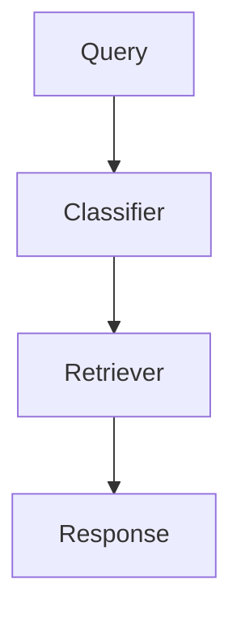

# Contributing to Kairos

Kairos is an open-source, explainable RAG research workbench. Contributions of all kinds are welcome — bug reports, feature requests, documentation improvements, and code.

## How to Contribute

### Reporting Issues

Open a GitHub issue with:

- Steps to reproduce
- Expected vs actual behavior
- Environment details (OS, browser, Node/Python version)
- Relevant logs or screenshots

### Suggesting Features

Open an issue labeled **enhancement** with:

- Problem statement
- Proposed solution
- Alternatives considered

### Submitting Code

1. Fork the repository
2. Create a branch from `main` (`git checkout -b feat/my-feature`)
3. Make your changes
4. Run linters and tests (see below)
5. Open a pull request against `main`

Keep PRs focused on a single change. Write a clear description of what changed and why.

## Development Setup

### Prerequisites

- Node.js 20+
- Python 3.11+
- Docker and Docker Compose
- PostgreSQL (or use the Docker Compose database)

### Frontend (Next.js Portal)

```bash
cd apps/portal
npm install
cp .env.example .env.local
npx prisma generate
npx prisma db push
npm run dev
```

### Backend (Python Intelligence Layer)

```bash
pip install -r requirements.txt
python -m intelligence.main
```

### Go Gateway

```bash
cd gateway
go mod download
go run main.go
```

### Docker Compose (Full Stack)

```bash
docker compose up -d
```

## Code Style

### TypeScript

- Next.js conventions, strict mode, functional components
- Run `npm run lint` and `npx tsc --noEmit` before committing
- Use existing UI components from `apps/portal/src/components/ui/`
- Follow the existing patterns for server actions and API routes

### Python

- Type hints on all functions
- Run `ruff format` and `ruff check` before committing
- `pytest` for tests
- Use Pydantic models for data validation

### Go

- Standard Go formatting (`gofmt`)
- `go vet` and `staticcheck` before committing

## Running Tests

```bash
# Frontend
cd apps/portal && npm test

# Python — full suite
python -m pytest tests/ -v

# Python — targeted subset (fast)
python -m pytest tests/test_phase_b_integration.py tests/test_phase_b_stress.py -v

# Go
cd gateway && go test ./...
```

## Pull Request Process

1. Ensure your branch is up to date with `main`
2. Run all linters and type checks
3. Add tests for new functionality when applicable
4. Update documentation if your change affects the public API or user-facing behavior
5. Request a review from a maintainer
6. Address review feedback

PRs should pass CI checks before merging. Squash-merge is preferred for clean history.

## Architecture Overview

Kairos is built around the idea that **different queries require different retrieval strategies**.

```
Client (Next.js Portal)
  → Go API Gateway (Chi + gRPC)
    → Python Intelligence Engine
      → Query Classification
      → Retrieval Planning
      → Retrieval Execution (BM25 / Dense / Hybrid / Multi-hop)
      → Response Assembly
```

### Key Components

| Component | Location | Purpose |
|-----------|----------|---------|
| Portal | `apps/portal/` | Next.js frontend — knowledge bases, experiments, AI copilot |
| Gateway | `gateway/` | Go API gateway — routing, auth, rate limiting, caching |
| Intelligence | `intelligence/` | Python — query classification, retrieval, embeddings, evaluation |
| Proto | `proto/` | gRPC contract definitions |
| SDK | `sdk/` | Python client SDK |
| Benchmarks | `benchmarks/` | Evaluation datasets, load tests, profiling |

### Data Flow

1. User submits a query through the portal
2. Gateway authenticates and routes the request
3. Intelligence layer classifies the query and selects a retrieval strategy
4. Documents are retrieved, reranked, and assembled into a response
5. Results are returned with full provenance and confidence scores

## Project Structure

```
kairos/
├── apps/portal/         # Next.js application
├── gateway/             # Go API gateway
├── intelligence/        # Python intelligence layer
├── proto/               # gRPC contracts
├── sdk/                 # Python client SDK
├── benchmarks/          # Evaluation datasets and load tests
├── docker/              # Multi-stage Dockerfiles
├── docs/                # Architecture and operations docs
├── scripts/             # Build, release, benchmark scripts
├── tests/               # Integration and stress tests
└── examples/            # Usage examples
```

## Documentation

### Mermaid Diagram Syntax

Kairos docs use [Mermaid](https://mermaid-js.github.io/mermaid/) for diagrams. Keep the syntax minimal:

````markdown

````

Supported types: `graph`, `sequenceDiagram`, `classDiagram`, `stateDiagram`, `gantt`, `pie`. See the [Mermaid docs](https://mermaid-js.github.io/mermaid/) for full syntax.

## Code of Conduct

Please follow the [Code of Conduct](CODE_OF_CONDUCT.md) in all interactions.
