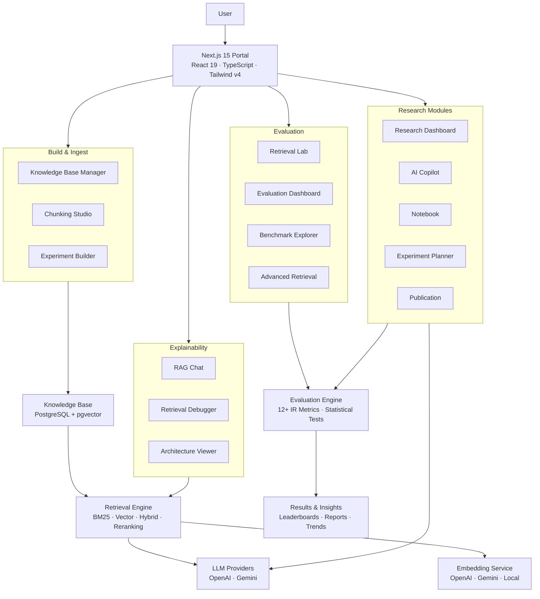
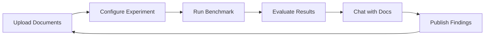
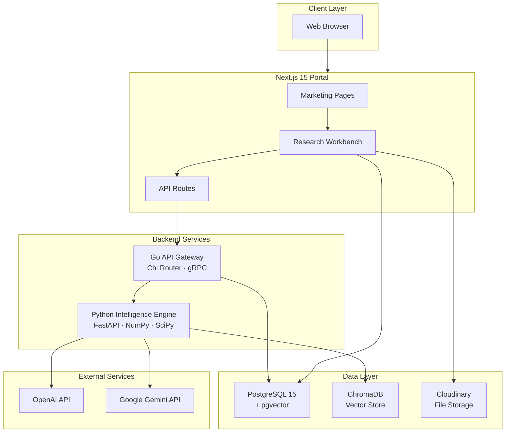

<p align="center">
  
</p>

<h1 align="center">Kairos</h1>

<p align="center">
  <strong>An Explainable AI Research Workbench for Retrieval-Augmented Generation</strong>
</p>

<p align="center">
  Document intelligence, benchmarking, and evaluation — with full transparency into how answers are constructed from your documents.
</p>

<p align="center">
  <a href="LICENSE"></a>
  <a href="#"></a>
  <a href="#"></a>
  <a href="#"></a>
  <a href="#"></a>
  <a href="#"></a>
  <a href="#"></a>
  <a href="#"></a>
  <a href="#"></a>
</p>

---

## What is Kairos?

Kairos is an open-source research workbench for **Retrieval-Augmented Generation** (RAG) pipelines. It provides end-to-end pipeline visibility across ingestion, chunking, embedding, retrieval, generation, and evaluation — with statistical rigor at every stage.

Most RAG tools give you a black box. Kairos gives you full transparency:

- **Every query decision is inspectable** — trace retrieval strategies, chunk selection, and generation inputs
- **Statistical rigor** — 12+ IR metrics with confidence intervals, p-values, and effect sizes
- **Reproducible experiments** — run multiple strategies against labeled datasets with full configuration capture
- **Production architecture** — PostgreSQL, gRPC, Prometheus, and Docker

---

## Features

| Feature | Description |
|---------|-------------|
| **Explainable Retrieval** | Full pipeline trace per query. Inspect retrieved chunks, similarity scores, and document inclusion decisions. |
| **Statistical Evaluation** | 12+ metrics with confidence intervals, p-values, effect sizes, and distribution analysis. |
| **Benchmark Campaigns** | Leaderboard with composite scores. Run A/B comparisons across retrieval configurations. |
| **Experiment Tracking** | Run multiple strategies against labeled datasets. Capture configurations, results, and reproduce any experiment. |
| **RAG Chat** | Chat interface with inline citations and per-message pipeline traces. |
| **Chunking Studio** | 5 chunking strategies with visual preview and size analysis. |
| **Research Intelligence** | Automated pattern discovery, trend detection, root cause inference, and experiment suggestions. |
| **Architecture Visualization** | Interactive SVG diagram of the full system with module details. |
| **Report Generator** | Academic reports in Markdown with executive summaries, configuration matrices, and statistical analysis. |
| **Retrieval Lab** | Test retrieval configurations interactively with real-time parameter adjustment. |
| **Advanced Retrieval** | Compare hybrid search, query expansion, multi-query, and reranking strategies. |
| **AI Copilot** | Context-aware research assistant with intent detection, evidence selection, and grounding. |
| **Experiment Planner** | Automated experiment planning with cost-quality tradeoff analysis. |
| **Knowledge Base Management** | Upload, organize, and manage research documents with automatic chunking and embedding. |

---

## Architecture



---

## Tech Stack

| Layer | Technology |
|-------|------------|
| **Frontend** | Next.js 15, React 19, TypeScript 5.8, Tailwind CSS v4, Framer Motion, Recharts |
| **API Gateway** | Go 1.22, Chi Router, gRPC, Protocol Buffers |
| **Intelligence** | Python 3.11+, FastAPI, NumPy, SciPy, scikit-learn |
| **Database** | PostgreSQL 15, pgvector, Prisma ORM |
| **Vector Store** | ChromaDB (pluggable) |
| **Observability** | Prometheus, Grafana, OpenTelemetry |
| **Infrastructure** | Docker, Docker Compose |

---

## Project Structure

```
kairos/
├── apps/
│   └── portal/                    # Next.js 15 frontend
│       ├── src/
│       │   ├── app/               # App router (pages & API routes)
│       │   │   ├── (marketing)/   # Public marketing pages
│       │   │   ├── app/           # Authenticated research workbench
│       │   │   └── api/           # API endpoints
│       │   ├── components/        # React components
│       │   │   ├── app/           # App-specific components
│       │   │   ├── marketing/     # Marketing page components
│       │   │   ├── research/      # Research UI components
│       │   │   ├── shared/        # Shared utilities
│       │   │   └── ui/            # Design system primitives
│       │   └── lib/               # Utilities, actions, AI subsystem
│       │       ├── ai/            # AI providers, chat, embeddings
│       │       ├── copilot/       # Research copilot engine
│       │       ├── evaluation/    # Metrics, benchmarks, statistics
│       │       ├── retrieval/     # Search strategies, debugger
│       │       └── telemetry/     # Analytics, health, metrics
│       └── prisma/                # Database schema
├── gateway/                       # Go API gateway
│   ├── api/                       # HTTP handlers
│   ├── middleware/                 # Auth, rate limiting
│   └── intelligence/              # gRPC client
├── intelligence/                  # Python intelligence engine
│   ├── api/                       # FastAPI server
│   ├── classifier/                # Query classification
│   ├── planner/                   # Retrieval planning
│   ├── retrieval/                 # Search strategies
│   ├── evaluation/                # IR metrics
│   └── calibration/               # Confidence calibration
├── benchmarks/                    # Evaluation framework
├── sdk/                           # Python SDK
├── tests/                         # 1,768 tests
├── docker/                        # Dockerfiles
├── docs/                          # Documentation
└── proto/                         # gRPC contracts
```

---

## How It Works

### 1. Upload Documents

Upload PDFs, Word documents, plain text, or markdown files into a Knowledge Base. Documents are automatically chunked using one of 5 strategies (fixed-size, recursive, semantic, paragraph, or heading-based) and embedded into a vector store.

### 2. Build Experiments

Configure retrieval experiments with different parameters:
- **Embedding models** — OpenAI, Gemini, or local embeddings
- **Retrieval strategies** — Vector, BM25, hybrid, or reranked
- **Chunking configurations** — Size, overlap, and strategy
- **Top-K values** — How many chunks to retrieve

### 3. Run Benchmarks

Execute benchmark campaigns against labeled datasets. Each run captures full configuration, per-question metrics, and retrieval traces for reproducibility.

### 4. Evaluate with Statistical Rigor

Kairos computes 12+ IR metrics per question:
- **Retrieval** — Recall@K, Precision@K, MRR, nDCG, Hit Rate, MAP, F1@K
- **Generation** — Faithfulness, Answer Relevance, Context Precision, Context Recall
- **Statistics** — Confidence intervals, p-values, effect sizes (Cohen's d, Cliff's delta)

### 5. Chat with Your Documents

Use the RAG Chat interface to ask questions and see exactly how answers are constructed. Each response includes inline citations, retrieved chunks, similarity scores, and a full pipeline trace.

---

## Supported Document Formats

| Format | Extension | Parser |
|--------|-----------|--------|
| PDF | `.pdf` | pdf-parse |
| Microsoft Word | `.docx` | mammoth |
| Plain Text | `.txt` | Native |
| Markdown | `.md` | Native |
| CSV | `.csv` | csv-parse |

---

## Screenshots

<p align="center">
  
</p>

<p align="center">
  
</p>

<p align="center">
  
</p>

<p align="center">
  
</p>

<p align="center">
  
</p>

---

## Installation

### Prerequisites

- Node.js 20+
- Python 3.11+
- Go 1.22+
- PostgreSQL 15+ (with pgvector extension)
- Docker (optional)

### 1. Clone & Install

```bash
git clone https://github.com/your-org/kairos.git
cd kairos

# Frontend
cd apps/portal
cp .env.example .env
npm install

# Intelligence Engine
cd ../../
pip install -r requirements.txt
```

### 2. Setup Database

```bash
cd apps/portal
npx prisma generate
npx prisma db push
```

### 3. Run

```bash
# Frontend (port 3000)
cd apps/portal
npm run dev

# Intelligence Engine (port 8000)
cd ../../
python -m intelligence.main

# Gateway (port 8080)
cd gateway
go run main.go
```

### 4. Docker (Full Stack)

```bash
docker-compose up -d
```

Visit [http://localhost:3000](http://localhost:3000)

---

## Environment Variables

### Required

| Variable | Description |
|----------|-------------|
| `DATABASE_URL` | PostgreSQL connection string for Prisma ORM |
| `BETTER_AUTH_SECRET` | Secret for signing auth tokens (`openssl rand -base64 32`) |

### Optional — AI Providers

| Variable | Description | Default |
|----------|-------------|---------|
| `AI_PROVIDER` | Default AI provider (`openai` or `gemini`) | `openai` |
| `OPENAI_API_KEY` | OpenAI API key for chat and embeddings | — |
| `OPENAI_CHAT_MODEL` | OpenAI chat model | `gpt-4o-mini` |
| `OPENAI_EMBEDDING_MODEL` | OpenAI embedding model | `text-embedding-3-small` |
| `GEMINI_API_KEY` | Google Gemini API key | — |
| `GEMINI_CHAT_MODEL` | Gemini chat model | `gemini-2.0-flash` |
| `GEMINI_EMBEDDING_MODEL` | Gemini embedding model | `text-embedding-004` |

### Optional — Storage

| Variable | Description |
|----------|-------------|
| `CLOUDINARY_CLOUD_NAME` | Cloudinary cloud name for file storage |
| `CLOUDINARY_API_KEY` | Cloudinary API key |
| `CLOUDINARY_API_SECRET` | Cloudinary API secret |

### Optional — Authentication

| Variable | Description |
|----------|-------------|
| `GITHUB_CLIENT_ID` | GitHub OAuth client ID |
| `GITHUB_CLIENT_SECRET` | GitHub OAuth client secret |
| `NEXT_PUBLIC_BETTER_AUTH_URL` | Public auth URL (default: `http://localhost:3000`) |

See [`.env.example`](.env.example) for the full configuration reference.

---

## Running Locally

```bash
# Install dependencies
cd apps/portal && npm install

# Setup database
npx prisma generate
npx prisma db push

# Start development server
npm run dev
```

The portal runs at [http://localhost:3000](http://localhost:3000).

### Available Scripts

| Command | Description |
|---------|-------------|
| `npm run dev` | Start development server |
| `npm run build` | Production build |
| `npm run start` | Start production server |
| `npm run lint` | Run ESLint |

---

## Project Workflow



1. **Ingest** — Upload documents to a Knowledge Base
2. **Configure** — Set up retrieval strategies and parameters
3. **Benchmark** — Execute experiments against labeled datasets
4. **Evaluate** — Analyze results with statistical rigor
5. **Chat** — Query your documents with full traceability
6. **Publish** — Generate academic reports with findings

---

## Example Usage

### Create a Knowledge Base

```bash
# Via the UI: Navigate to Document Repository → Create Knowledge Base
# Or via API:
curl -X POST http://localhost:3000/api/knowledge-bases \
  -H "Content-Type: application/json" \
  -d '{"name": "Research Papers"}'
```

### Upload Documents

```bash
# Via the UI: Drag and drop files into the Knowledge Base
# Supported: PDF, DOCX, TXT, MD, CSV
```

### Run a Benchmark

```bash
# Via the UI: Navigate to Benchmark Explorer → New Benchmark
# Select your Knowledge Base, dataset, and retrieval configuration
```

### Chat with Your Documents

```bash
# Via the UI: Navigate to RAG Chat
# Ask questions and see inline citations with pipeline traces
```

---

## Benchmarks

Kairos implements 12+ Information Retrieval metrics:

### Retrieval Metrics

| Metric | Description |
|--------|-------------|
| Recall@K | Proportion of relevant documents retrieved in top K |
| Precision@K | Proportion of retrieved documents that are relevant |
| MRR | Mean Reciprocal Rank of first relevant result |
| nDCG@K | Normalized Discounted Cumulative Gain |
| Hit Rate | Whether any relevant document appears in top K |
| MAP | Mean Average Precision across queries |
| F1@K | Harmonic mean of Precision@K and Recall@K |

### Generation Metrics

| Metric | Description |
|--------|-------------|
| Faithfulness | LLM-judged answer faithfulness to context |
| Answer Relevance | LLM-judged answer relevance to question |
| Context Precision | LLM-judged context quality |
| Context Recall | LLM-judged context completeness |

### Statistical Tests

| Test | Description |
|------|-------------|
| Paired t-test | Compare two configurations |
| Wilcoxon signed-rank | Non-parametric comparison |
| Cohen's d | Effect size measurement |
| Cliff's delta | Non-parametric effect size |
| Confidence intervals | 95% CI for all metrics |

---

## Architecture Diagram



---

## Future Improvements

- HNSW indexing for faster vector search
- Streaming RAG responses
- Multi-tenant support
- Custom embedding model training
- Automated hyperparameter optimization
- Integration with LangChain and LlamaIndex
- Real-time collaboration on experiments
- Export to Jupyter notebooks

---

## Contributing

See [CONTRIBUTING.md](CONTRIBUTING.md) for:
- Development setup
- Code style guide
- Pull request process
- Architecture overview

---

## License

MIT License — see [LICENSE](LICENSE) for details.

---

<p align="center">
  Built with care for the RAG research community.
</p>
