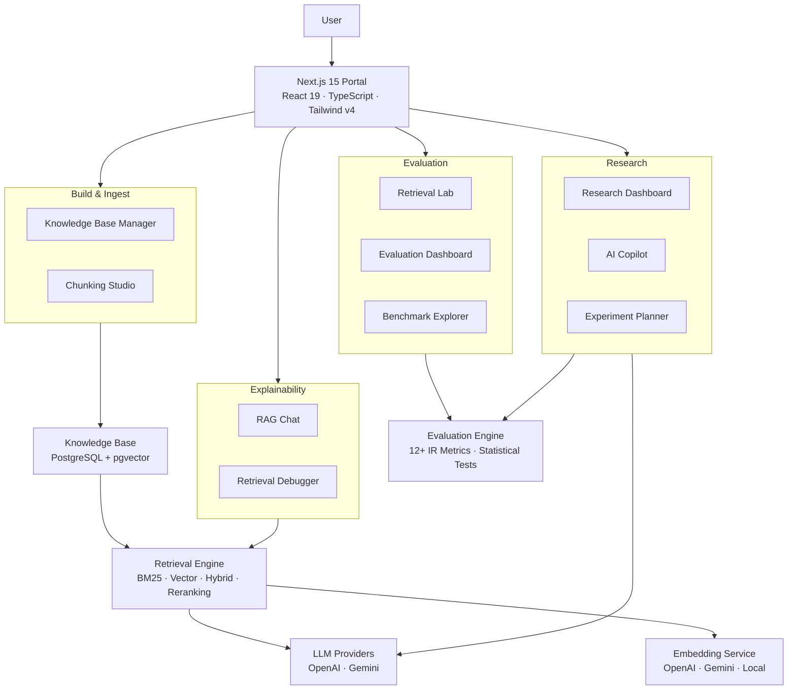

<p align="center">
  
</p>

<h1 align="center">Kairos</h1>

<p align="center">
  <strong>Explainable AI Workbench for Retrieval-Augmented Generation</strong>
</p>

<p align="center">
  End-to-end RAG pipeline visibility — from ingestion and chunking through retrieval and generation — with statistical rigor at every stage.
</p>

<p align="center">
  <a href="LICENSE"></a>
  <a href="#"></a>
  <a href="#"></a>
  <a href="#"></a>
  <a href="#"></a>
  <a href="#"></a>
  <a href="#"></a>
</p>

<p align="center">
  <a href="#quick-start">Quick Start</a> ·
  <a href="#architecture">Architecture</a> ·
  <a href="#why-kairos">Why Kairos</a> ·
  <a href="#features">Features</a> ·
  <a href="#contributing">Contributing</a>
</p>

---

## What is Kairos?

Kairos is an open-source research workbench for **Retrieval-Augmented Generation** (RAG) pipelines. It gives you full visibility into how answers are constructed from your documents — every retrieval decision, every chunk selection, every generation input is inspectable.

Most RAG tools are black boxes. **Kairos is a microscope.**

---

## Why Kairos?

| | Traditional RAG Tools | Kairos |
|---|---|---|
| Retrieval | Black box — trust the results | **Explainable** — trace every decision |
| Evaluation | Basic similarity scores | **Statistical rigor** — 12+ IR metrics with confidence intervals |
| Experiments | Manual, ad-hoc | **Reproducible** — full configuration capture per run |
| Debugging | Logs and guesswork | **Pipeline traces** — inspect chunks, scores, and inferences |
| Benchmarking | One-off comparisons | **Campaign mode** — A/B testing across configurations |

---

## Features

<table>
<tr>
<td width="50%">

### 🔍 Explainable Retrieval
Full pipeline trace per query. Inspect retrieved chunks, similarity scores, and document inclusion decisions.

### 📊 Statistical Evaluation
12+ IR metrics with confidence intervals, p-values, effect sizes (Cohen's d, Cliff's delta), and distribution analysis.

### 🧪 Experiment Tracking
Run multiple strategies against labeled datasets. Capture configurations, results, and reproduce any experiment.

</td>
<td width="50%">

### 💬 RAG Chat
Chat interface with inline citations, retrieved chunks, similarity scores, and per-message pipeline traces.

### ⚡ Production Architecture
Go gateway for performance. Python intelligence engine for ML. gRPC, Prometheus, Docker-ready.

### 📈 Benchmark Campaigns
Leaderboard with composite scores. Run A/B comparisons across retrieval configurations with statistical validation.

</td>
</tr>
</table>

---

## Architecture

**Simple flow:**

```
User → Next.js Portal → Go Gateway → Python Intelligence → Postgres + Vector Store → LLM Providers
```

**Detailed system:**



---

## Tech Stack

**Frontend**
Next.js 15 · React 19 · TypeScript 5.8 · Tailwind CSS v4 · Framer Motion · Recharts

**Backend**
Go 1.22 · Chi Router · gRPC · Protocol Buffers · FastAPI

**AI & ML**
Python 3.11+ · SentenceTransformers · NumPy · SciPy · scikit-learn

**Data**
PostgreSQL 15 · pgvector · Prisma ORM · ChromaDB (pluggable)

**Observability**
Prometheus · Grafana · OpenTelemetry

**Infrastructure**
Docker · Docker Compose

---

## Project Structure

```
kairos/
├── apps/portal/          # Next.js 15 frontend (React, TypeScript, Tailwind)
├── gateway/              # Go API gateway (Chi, gRPC, worker pool)
├── intelligence/         # Python engine (retrieval, embeddings, ingestion)
├── benchmarks/           # Evaluation framework (load tests, RAG evaluation)
├── sdk/                  # Python SDK
├── tests/                # 1,800+ tests
├── docker/               # Multi-stage Dockerfiles
├── docs/                 # Documentation
└── proto/                # gRPC contracts
```

---

## How It Works

### 1. Upload Documents

Upload PDFs, plain text, or markdown. Documents are chunked using one of 5 strategies (fixed-size, structural, semantic, paragraph, heading-based) and embedded into a vector store.

### 2. Build Experiments

Configure retrieval experiments with different embedding models (OpenAI, Gemini, local), retrieval strategies (vector, BM25, hybrid, reranked), chunking configurations, and top-K values.

### 3. Run Benchmarks

Execute benchmark campaigns against labeled datasets. Each run captures full configuration, per-question metrics, and retrieval traces for reproducibility.

### 4. Evaluate with Statistical Rigor

Compute 12+ IR metrics per question — Recall@K, Precision@K, MRR, nDCG, Hit Rate, MAP, F1@K — plus generation metrics (Faithfulness, Answer Relevance, Context Precision, Context Recall) with confidence intervals and effect sizes.

### 5. Chat with Your Documents

Use RAG Chat to ask questions and see exactly how answers are constructed, with inline citations, retrieved chunks, similarity scores, and a full pipeline trace.

---

## Quick Start

### Docker (Recommended)

```bash
git clone https://github.com/kairos-ai/kairos.git
cd kairos
cp .env.example .env
# Edit .env with your API keys
docker compose up -d
```

| Service | URL |
|---------|-----|
| Portal | http://localhost:8080 |
| Grafana | http://localhost:3000 |
| Prometheus | http://localhost:9090 |

### Manual Setup

**Prerequisites:** Node.js 20+, Python 3.11+, Go 1.22+, PostgreSQL 15+ (with pgvector)

```bash
git clone https://github.com/kairos-ai/kairos.git
cd kairos

# Frontend
cd apps/portal && cp .env.example .env
npm install && npx prisma generate && npx prisma db push && npm run dev

# Intelligence Engine (new terminal)
cd ../../ && pip install -r requirements.txt && python -m intelligence.main

# Gateway (new terminal)
cd gateway && go run main.go
```

---

## Deployment

### Docker Compose Services

| Service | Port | Description |
|---------|------|-------------|
| `gateway` | 8080 | Go API gateway |
| `intelligence` | 28080 | Python gRPC server |
| `api` | 8000 | FastAPI REST server |
| `internal-dashboard` | 8501 | Streamlit dashboard |
| `worker` | — | Background ingestion worker |
| `chromadb` | 7777 | Vector database |
| `prometheus` | 9090 | Metrics collection |
| `grafana` | 3000 | Metrics visualization |

```bash
docker compose up -d
docker compose ps          # Check health
docker compose logs -f     # Follow logs
docker compose down        # Stop
```

### Resource Limits

| Service | CPU | Memory |
|---------|-----|--------|
| Intelligence | 2 cores | 4 GB |
| API | 1 core | 2 GB |
| Gateway | 0.5 core | 512 MB |
| ChromaDB | 1 core | 2 GB |
| Worker | 1 core | 2 GB |

---

## Environment Variables

### Required

| Variable | Description |
|----------|-------------|
| `DATABASE_URL` | PostgreSQL connection string for Prisma ORM |
| `KAIROS_SECRET` | Shared API secret for authentication |

### Intelligence Engine

| Variable | Description | Default |
|----------|-------------|---------|
| `KAIROS_LLM_PROVIDER` | LLM provider (`gemini`, `openai`, `ollama`) | — |
| `KAIROS_DEPLOYMENT` | Production mode with Groq | `False` |
| `KAIROS_CHUNK_SIZE` | Chunk size in characters | `1024` |
| `KAIROS_OVERLAP` | Chunk overlap in characters | `150` |
| `KAIROS_EMBEDDING_MODEL` | Embedding backend (`local`) | `local` |
| `KAIROS_CACHE_MAXSIZE` | Embedding cache size | `4096` |
| `KAIROS_CACHE_TTL_SECONDS` | Cache TTL in seconds | `300` |
| `KAIROS_METRICS_ENABLED` | Enable Prometheus metrics | `True` |
| `KAIROS_METRICS_PORT` | Prometheus metrics port | `8001` |
| `KAIROS_HEALTH_CHECK_ENABLED` | Enable gRPC health checks | `True` |
| `KAIROS_PROVIDER_TIMEOUT_SECONDS` | LLM provider timeout | `30.0` |
| `KAIROS_CIRCUIT_BREAKER_FAILURE_THRESHOLD` | Circuit breaker threshold | `5` |
| `KAIROS_CIRCUIT_BREAKER_RECOVERY_TIMEOUT` | Circuit breaker recovery | `30.0` |

### AI Providers

| Variable | Description |
|----------|-------------|
| `GEMINI_API_KEY` | Google Gemini API key |
| `KAIROS_GEMINI_MODEL_NAME` | Gemini model name |
| `OPENAI_API_KEY` | OpenAI API key |
| `KAIROS_OPENAI_MODEL_NAME` | OpenAI model name |
| `GROQ_API_KEY` | Groq API key (production) |
| `GROQ_BASE_URL` | Groq base URL |

### Gateway

| Variable | Description | Default |
|----------|-------------|---------|
| `GATEWAY_HOST` | Gateway bind host | `0.0.0.0` |
| `GATEWAY_PORT` | Gateway port | `8080` |
| `KAIROS_RATE_LIMIT` | Requests per second per namespace | — |
| `KAIROS_BURST_LIMIT` | Burst limit | — |
| `MAX_FILE_SIZE` | Max upload size in MB | `50` |
| `KAIROS_CACHE_MAX_SIZE` | Semantic cache size | — |
| `KAIROS_CACHE_TTL` | Semantic cache TTL (seconds) | — |
| `KAIROS_CACHE_SIMILARITY_THRESHOLD` | Cache similarity threshold | — |
| `KAIROS_CORS_ORIGINS` | Allowed CORS origins | `*` |

See [`.env.example`](.env.example) for the full configuration reference.

---

## API Reference

### Gateway (port 8080)

| Method | Endpoint | Description |
|--------|----------|-------------|
| `GET` | `/health` | Health check |
| `POST` | `/v1/query` | Execute RAG query |
| `POST` | `/v1/ingest` | Upload document |
| `GET` | `/v1/jobs/{job_id}` | Check job status |
| `GET` | `/metrics` | Prometheus metrics |

### Intelligence Engine (port 28080 — gRPC)

| RPC | Description |
|-----|-------------|
| `ComputeEmbeddings` | Generate embeddings for text |
| `ClassifyQueryType` | Classify query and select retrieval strategy |
| `ExecuteRetrieval` | Execute retrieval with given config |
| `GenerateResponse` | Generate LLM response from context |
| `IngestDocument` | Ingest and index a document |

---

## Benchmarks & Metrics

### Retrieval Metrics

| Metric | Description |
|--------|-------------|
| Recall@K | Proportion of relevant documents retrieved in top K |
| Precision@K | Proportion of retrieved documents that are relevant |
| MRR | Mean Reciprocal Rank of first relevant result |
| nDCG@K | Normalized Discounted Cumulative Gain |
| Hit Rate | Whether any relevant document appears in top K |
| MAP | Mean Average Precision across queries |
| F1@K | Harmonic mean of Precision@K and Recall@K |

### Generation Metrics

| Metric | Description |
|--------|-------------|
| Faithfulness | LLM-judged answer faithfulness to context |
| Answer Relevance | LLM-judged answer relevance to question |
| Context Precision | LLM-judged context quality |
| Context Recall | LLM-judged context completeness |

### Statistical Tests

| Test | Description |
|------|-------------|
| Paired t-test | Compare two configurations |
| Wilcoxon signed-rank | Non-parametric comparison |
| Cohen's d | Effect size measurement |
| Cliff's delta | Non-parametric effect size |
| Confidence intervals | 95% CI for all metrics |

---

## Performance Highlights

Kairos includes several performance optimizations built into the pipeline:

- **Persistent BM25 indexing** — avoids re-indexing on every startup
- **Go worker pool** — parallelized ingestion with configurable concurrency
- **Retrieval cache** — semantic + LRU caching for repeated queries
- **Batch embedding** — vectorized embedding generation for throughput
- **Optimized chunker** — streaming document processing with memory efficiency

---

## Who Is This For?

- **Researchers** — rigorous evaluation framework with statistical tests and reproducible experiments
- **ML Engineers** — production-ready RAG pipeline with monitoring and observability
- **RAG Developers** — full visibility into retrieval and generation decisions
- **Students** — learn how RAG pipelines work with interactive exploration
- **Open Source Contributors** — well-structured codebase across Go, Python, and TypeScript

---

## Roadmap

### Near-term
- [ ] HNSW indexing for faster vector search
- [ ] Streaming RAG responses
- [ ] Multi-tenant support

### Future
- [ ] Custom embedding model training
- [ ] Automated hyperparameter optimization
- [ ] Integration with LangChain and LlamaIndex

### Research Ideas
- [ ] Real-time collaboration on experiments
- [ ] Export to Jupyter notebooks

---

## Supported Formats

| Format | Extension | Parser |
|--------|-----------|--------|
| PDF | `.pdf` | pypdf |
| Plain Text | `.txt` | Native UTF-8 |
| Markdown | `.md` | Native |
| CSV | `.csv` | csv-parse |

---

## Contributing

See [CONTRIBUTING.md](CONTRIBUTING.md) for development setup, code style guide, pull request process, and architecture overview.

---

## Security

See [SECURITY.md](SECURITY.md) for vulnerability reporting, security best practices, and supported versions.

---

## License

MIT License — see [LICENSE](LICENSE) for details.

---

<p align="center">
  Built with care for the RAG research community.
</p>
