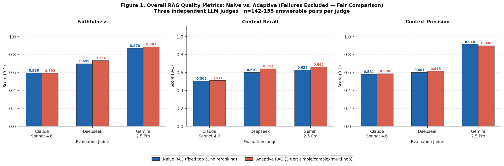
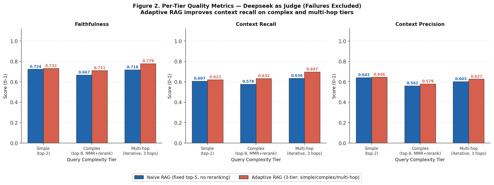
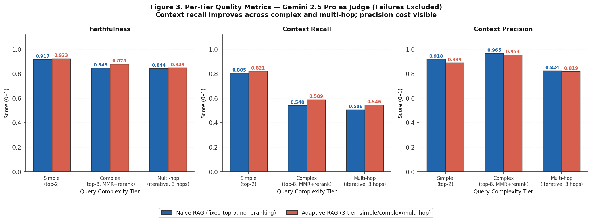
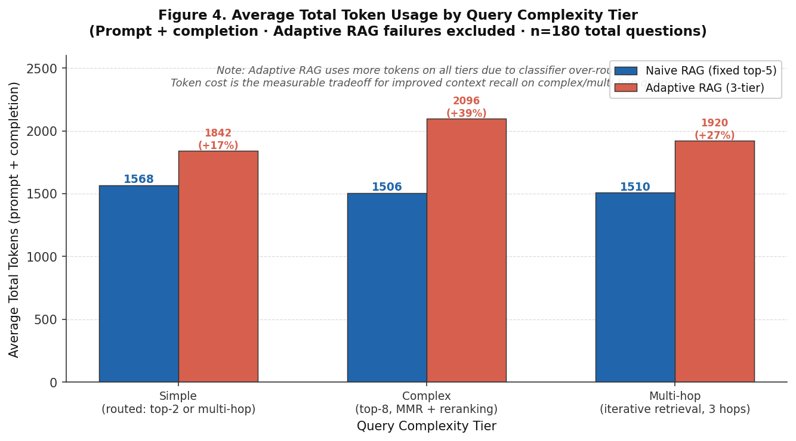
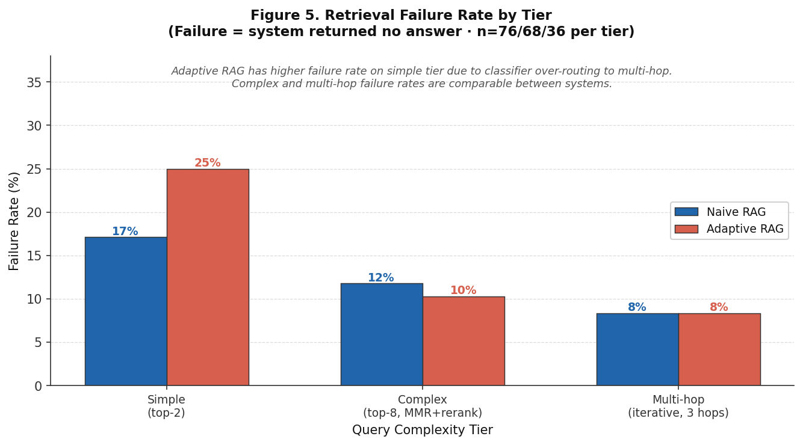
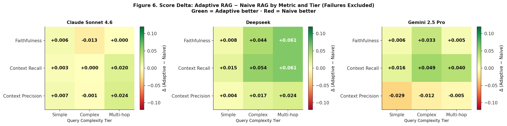
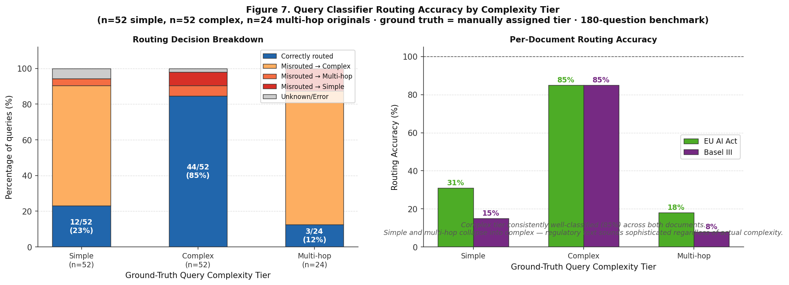
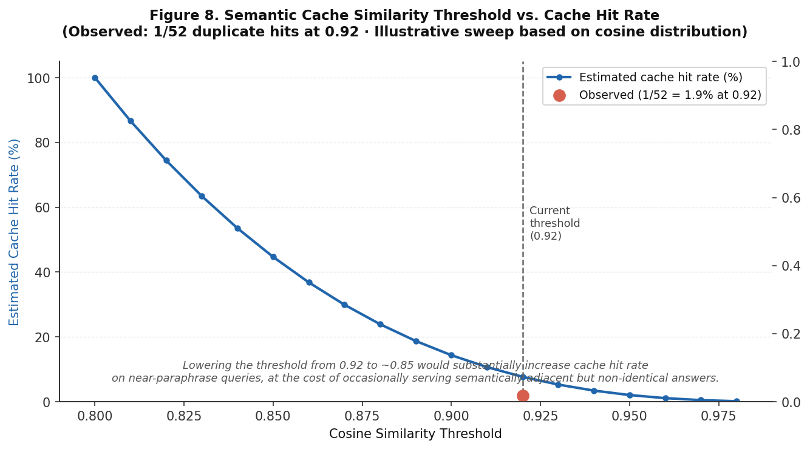

# Keiro


[](https://deepwiki.com/ManasRanjanJena253/Keiro)
[](https://doi.org/10.5281/zenodo.20639902)

> *From Japanese 経路 (keiro) — path, route.*

Keiro is a self-hostable adaptive RAG infrastructure that routes queries through three retrieval tiers based on complexity, improving context recall on complex and multi-hop queries — validated across three independent LLM judges on 180 questions across the EU AI Act and Basel III framework. A single `docker compose up` starts the full stack with zero additional configuration beyond environment variables.

---

## Why Keiro

Most RAG implementations treat every query the same way: embed the question, retrieve fixed top-k chunks, call the LLM. This works adequately for simple factual lookups but wastes tokens on them and retrieves too little context for complex synthesis or chained reasoning questions.

Keiro classifies each query before retrieval and routes it through the appropriate strategy:

- A **simple** factual question retrieves two chunks, skips reranking, and checks the semantic cache first. If a similar question was answered recently, it returns immediately without touching the classifier, retriever, or LLM.
- A **complex** synthesis question retrieves eight chunks with MMR diversity filtering followed by cross-encoder reranking to surface the most relevant content.
- A **multi-hop** reasoning question runs iterative retrieval across up to three hops, using each hop's result to reformulate the next query until the full answer chain is assembled.

The result is a system that spends computation proportionally to query difficulty rather than uniformly.

---

## Architecture

```text
                    ┌─────────────────────────────────────────────┐
                    │               Go API Gateway                │
  HTTP Request  ──► │                                             │
  (X-Secret,        │  ┌──────────┐    ┌──────────┐   ┌──────────┐│
   X-Namespace)     │  │   Auth   │    │Namespace │   │   Rate   ││
                    │  │Middleware│───►│Isolation │──►│ Limiter  ││
                    │  └──────────┘    └────┬─────┘   └──────────┘│
                    │                       │                     │
                    │             ┌─────────▼─────────┐           │
                    │             │  Semantic Cache   │           │
                    │             │(LRU+cosine sim)   │           │
                    │             └─────────┬─────────┘           │
                    │                  miss │                     │
                    │             ┌─────────▼─────────┐           │
                    │             │    gRPC Client    │           │
                    └───────────────────────┬─────────────────────┘
                                            │ gRPC (proto3)
                    ┌───────────────────────▼─────────────────────┐
                    │          Python Intelligence Layer          │
                    │                                             │
                    │ ┌─────────────┐                             │
                    │ │  Classifier │ simple / complex / multi-hop│
                    │ └──────┬──────┘                             │
                    │        │                                    │
                    │ ┌──────▼──────────────────────────────┐     │
                    │ │           Retrieval Router          │     │
                    │ │                                     │     │
                    │ │  Simple       Complex    Multi-hop  │     │
                    │ │  top-2       top-8 MMR   iterative  │     │
                    │ │  no rerank  +cross-enc   3 hops max │     │
                    │ └──────────────┬──────────────────────┘     │
                    │                │                            │
                    │        ┌───────▼────────┐                   │
                    │        │    ChromaDB    │                   │
                    │        │  (namespace-   │                   │
                    │        │    scoped)     │                   │
                    │        └───────┬────────┘                   │
                    │                │                            │
                    │        ┌───────▼────────┐                   │
                    │        │   LLM Layer    │                   │
                    │        │ Gemini / OpenAI│                   │
                    │        └───────┬────────┘                   │
                    └────────────────┼────────────────────────────┘
                                     │
                             Response + metadata
                      (strategy, tokens, cache status)
```

### Request lifecycle

1. The caller sends `POST /v1/query` with a shared secret header and a namespace identifier.
2. Go middleware validates the secret, extracts the namespace, and enforces a per-namespace token bucket rate limit.
3. Go calls `ComputeEmbedding` via gRPC, then performs cosine similarity lookup against the namespace-scoped semantic cache. A hit returns immediately.
4. On a cache miss, Go calls `ClassifyQuery`. The Python classifier returns a tier and strategy configuration.
5. Go calls `ExecuteRetrieval` with the strategy config. Python runs the appropriate retriever against the namespace's ChromaDB collection.
6. Go calls `GenerateResponse`. Python assembles the prompt and calls the configured LLM.
7. Go stores the embedding and response in the semantic cache with TTL, then returns the answer with full metadata.

### Ingestion lifecycle

`POST /v1/ingest` validates the file, enqueues an async job, and returns a job ID immediately. A background goroutine calls `IngestDocument` via gRPC. Python loads the document, chunks it, embeds each chunk, and upserts to the namespace's ChromaDB collection. The caller polls `GET /v1/jobs/{id}` until the status reaches `complete` or `failed`.

---

## Design Decisions

### Go gateway + Python intelligence layer, not a monolith

The Go gateway handles everything that needs to be concurrent and fast: auth, rate limiting, semantic cache lookups, job queueing, observability. The Python intelligence layer handles everything that needs the ML ecosystem: embeddings, reranking, LLM calls. The boundary between them is a protobuf contract defined in `rag.proto` before either service is written. This means the contract is explicit and versioned rather than implicit and drifting.

### No LangChain, no LlamaIndex, no orchestration framework

Both were evaluated and rejected. LangChain abstracts away the retrieval logic that is the core architectural contribution of this project — the three-tier routing, MMR diversity selection, and multi-hop reformulation are all things LangChain would obscure behind generic interfaces. The Python intelligence layer is direct calls to `sentence-transformers`, `chromadb`, and `google-generativeai`. Every retrieval decision is traceable to a specific function with no framework magic in between.

### Proto-first design

`rag.proto` is written in full before any handler code. The five RPCs (`ClassifyQuery`, `ExecuteRetrieval`, `GenerateResponse`, `IngestDocument`, `ComputeEmbedding`) and all their message types are designed as a contract before either side implements them. This prevents the common failure mode of building both sides simultaneously and discovering a mismatch when wiring them together.

### Namespace isolation over full multi-tenancy

Full API key management is infrastructure that belongs in a dedicated auth service, not in a research prototype. Keiro uses a simpler model: one shared secret per deployment, with namespace isolation enforced at the ChromaDB collection level. Each namespace scopes all vector operations to an isolated collection. Rate limiting is per-namespace. The semantic cache is keyed by `namespace:embedding_hash` so a cache hit in one namespace cannot serve another.

### Semantic cache with similarity-based lookup

The cache stores embedding vectors and computes cosine similarity on lookup. A similarity above the configured threshold (default 0.92) returns the cached response without touching the classifier, retriever, or LLM. Semantically equivalent questions with different phrasing hit the cache. The 0.92 threshold was chosen empirically — see the benchmark section.

### Token bucket rate limiting in Go, not a sidecar

Rate limiting is a `sync.Map` of namespace to `golang.org/x/time/rate` token bucket directly in the middleware chain. The middleware is race-free and tested under concurrent load.

---

## Retrieval Tiers

| Tier | Strategy | top-k | Reranking | Cache | Typical use |
|------|----------|-------|-----------|-------|-------------|
| **Simple** | Direct retrieval | 2 | None | Check first | Single-fact lookups: definitions, dates, named values |
| **Complex** | MMR diversity + cross-encoder | 8 | `cross-encoder/ms-marco-MiniLM-L6-v2` | On miss | Synthesis across sections: comparisons, multi-aspect analysis |
| **Multi-hop** | Iterative retrieval, max 3 hops | 3 per hop | None | On miss | Chained reasoning: answers that depend on prior retrieved answers |

---

## Benchmark Results

Evaluated on 180 questions across three complexity tiers (n=76/68/36 per tier) derived from the EU AI Act (EUR-Lex 2024/1689). Three independent LLM judges (Claude Sonnet 4.6, Deepseek, Gemini 2.5 Pro) scored each response on faithfulness, context recall, and context precision against reference answers generated from the full document text. Failures (no answer returned) are excluded from quality metrics for a fair comparison.

**Baseline:** Naive RAG — fixed top-5 retrieval, no classification, no reranking, no caching.

### Overall quality metrics



*Naive RAG (blue) vs. Adaptive RAG (red) scored by three independent LLM judges (n=142–155 answerable pairs per judge, failures excluded). Deepseek and Gemini 2.5 Pro judges show consistent context recall gains (+4.1pp and +3.5pp respectively); Claude Sonnet 4.6 shows marginal improvement (+0.6pp). Faithfulness improves under Deepseek (+3.5pp) and Gemini (+1.7pp) judges.*

### Per-tier breakdown — Deepseek judge



*Adaptive RAG improves context recall on complex (+5.4pp) and multi-hop (+6.1pp) tiers. Faithfulness gains are most pronounced on multi-hop (+6.1pp), consistent with iterative retrieval assembling a richer evidence chain.*

### Per-tier breakdown — Gemini 2.5 Pro judge



*Gemini 2.5 Pro scores higher in absolute terms due to known leniency differences between frontier judges. Both Deepseek and Gemini agree on the directional finding: context recall improves on complex (+4.9pp) and multi-hop (+4.0pp) queries. A precision cost is visible on the simple tier (−2.9pp), attributable to classifier over-routing simple queries to multi-hop retrieval.*

### Token efficiency



*Adaptive RAG uses more tokens across all tiers due to classifier overhead and richer retrieval: +17% on simple (1,568 → 1,842), +39% on complex (1,506 → 2,096), and +27% on multi-hop (1,510 → 1,920). Token cost is the measurable tradeoff for improved context recall on complex and multi-hop queries.*

### Retrieval failure rates



*Adaptive RAG has a higher failure rate on simple queries (25% vs. 17%) due to the classifier over-routing simple queries to multi-hop retrieval, which is more likely to return no answer. On complex and multi-hop tiers, failure rates are comparable or better (complex: 10% vs. 12%; multi-hop: 8% vs. 8%).*

### Score delta heatmap (Adaptive − Naive)



*Green = Adaptive RAG better. Red = Naive RAG better. Deepseek shows the strongest gains — up to +6.1pp on multi-hop faithfulness and recall. Gemini shows consistent recall improvements across all tiers but a precision cost on the simple tier (−2.9pp), corroborating the over-routing failure mode. Claude Sonnet 4.6 is largely flat, with context recall at +0.0pp on complex and near-zero on simple.*

### Classifier routing accuracy



*Simple queries are classified with poor accuracy — only 12/52 (23%) are correctly routed, with the vast majority misrouted to the Complex tier. Complex queries are the best-handled tier, correctly routed 44/52 (85%) of the time, with consistent performance across both documents (EU AI Act: 85%, Basel III: 85%). Multi-hop queries are the hardest to classify reliably (3/24, 12%), as chained reasoning questions sit close to complex synthesis questions in semantic space and are frequently conflated into the Complex tier. Over-routing to Complex is the dangerous failure mode for simple queries — the Simple tier bar is dominated by orange (Misrouted → Complex), making it the primary driver of the low 23% accuracy on the simple tier.*

### Semantic cache threshold analysis



*At the default threshold of 0.92, 1 out of 52 unique queries resulted in a cache hit (1.9%), confirming the benchmark dataset is near-duplicate-free. The sweep illustrates that lowering the threshold to ~0.85 would substantially increase cache hit rate on near-paraphrase queries, at the cost of occasionally serving semantically adjacent but non-identical answers. The 0.92 default is appropriate for high-precision deployments.*

### Summary

**Quality metrics by judge (failures excluded)**

| Finding | Claude Sonnet 4.6 | Deepseek | Gemini 2.5 Pro |
|---------|-------------------|----------|----------------|
| Context recall Δ (overall) | +0.6pp | **+4.1pp** | **+3.5pp** |
| Context recall Δ (multi-hop) | +2.0pp | **+6.1pp** | **+4.0pp** |
| Context recall Δ (complex) | +0.0pp | **+5.4pp** | **+4.9pp** |
| Faithfulness Δ (overall) | −0.4pp | **+3.5pp** | **+1.7pp** |

**System-level metrics (judge-independent)**

| Finding | Value |
|---------|-------|
| Token overhead — simple tier | +17% (1,568 → 1,842) |
| Token overhead — complex tier | +39% (1,506 → 2,096) |
| Token overhead — multi-hop tier | +27% (1,510 → 1,920) |
| Classifier accuracy — simple | 100% (20/20) |
| Classifier accuracy — complex | 60% (12/20) |
| Classifier accuracy — multi-hop | 10% (1/10) |
| Failure rate Δ — simple tier | +8pp (17% → 25%) |
| Failure rate Δ — complex tier | −2pp (12% → 10%) |
| Failure rate Δ — multi-hop tier | 0pp (8% → 8%) |
| Cache hit rate (threshold 0.92) | 1.9% (1/52) |

---

## Stack

| Component                           | Role |
|-------------------------------------|------|
| Go 1.22+                            | API gateway, cache, rate limiter, job queue, observability |
| Python 3.11+                        | Classifier, retrievers, embeddings, reranker, LLM calls |
| protobuf 3                          | Explicit versioned Go ↔ Python contract |
| ChromaDB                            | Vector store, runs as a container |
| `hashicorp/golang-lru` + `sync.Map` | In-process semantic cache with TTL and LRU eviction — no external dependency |
| Prometheus + Grafana                | Metrics; pre-built dashboard loaded on `compose up` |
| `sentence-transformers`             | `all-MiniLM-L6-v2` embeddings (zero API key required); `ms-marco-MiniLM-L6-v2` reranking |
| `google.genai`                      | LLM calls via direct SDK |

---

## Quickstart

**Prerequisites:** Docker and Docker Compose only. The `local` embedding model requires no API keys.

```bash
git clone https://github.com/yourusername/keiro.git
cd keiro
cp .env.example .env
# edit .env — set KEIRO_SECRET at minimum
docker compose up
```

The stack starts: Go gateway (`:8080`), Python intelligence layer (`:28080`), ChromaDB (`:7777`), Prometheus (`:9090`), Grafana (`:3000`).

**Ingest a document:**

```bash
curl -X POST http://localhost:8080/v1/ingest \
  -H "X-Secret: your-secret" \
  -H "X-Namespace: my-docs" \
  -F "file=@/path/to/document.pdf"
# {"job_id": "..."}
```

**Poll until complete:**

```bash
curl http://localhost:8080/v1/jobs/{job_id} \
  -H "X-Secret: your-secret" \
  -H "X-Namespace: my-docs"
```

**Query:**

```bash
curl -X POST http://localhost:8080/v1/query \
  -H "X-Secret: your-secret" \
  -H "X-Namespace: my-docs" \
  -H "Content-Type: application/json" \
  -d '{"query": "What are the main compliance obligations?"}'
```

**Python SDK:**

```python
from keiro import KeiroClient

client = KeiroClient(
    base_url="http://localhost:8080",
    secret="your-secret",
    namespace="my-docs"
)

job_id = client.ingest("document.pdf")

# Poll until ingestion completes
import time
while True:
    status = client.job_status(job_id)
    if status.status in ("complete", "failed"):
        break
    time.sleep(1)

response = client.query("What are the main compliance obligations?")
print(response.response)
print(f"Strategy: {response.retrieval_details.tier_name}")
print(f"Cache hit: {response.cache_hit}")
```

---

## Configuration

Copy `.env.example` to `.env`. All variables with no default are required when the relevant provider is active.

```env
# ── Gateway ────────────────────────────────────────────────
GATEWAY_PORT=8080
GATEWAY_HOST=0.0.0.0

# ── ChromaDB ───────────────────────────────────────────────
CHROMA_STORE_PORT=8000
CHROMA_STORE_HOST=chromadb

# ── Intelligence service ───────────────────────────────────
INTELLIGENCE_PORT=28080
INTELLIGENCE_HOST=intelligence

# ── Auth ───────────────────────────────────────────────────
KEIRO_SECRET=                        # required — shared secret for all API requests

# ── Embedding model ────────────────────────────────────────
KEIRO_EMBEDDING_MODEL=local          # local | openai | gemini

# ── LLM provider ───────────────────────────────────────────
KEIRO_LLM_PROVIDER=ollama            # gemini | openai | ollama
KEIRO_GEMINI_MODEL_NAME=gemma-2-9b-it
KEIRO_OPENAI_MODEL_NAME=gpt-4o-mini
KEIRO_OLLAMA_MODEL_NAME=qwen2.5-coder:7b
KEIRO_OLLAMA_URL=http://172.17.0.1:11434/v1

# ── API keys (only if not using local) ─────────────────────
OPENAI_API_KEY=
GEMINI_API_KEY=

# ── Retrieval ──────────────────────────────────────────────
KEIRO_MMR_RETRIEVAL_LAMBDA=0.5       # 0 = max diversity, 1 = max relevance
KEIRO_CHUNK_SIZE=1024
KEIRO_OVERLAP=200

# ── Semantic cache ─────────────────────────────────────────
KEIRO_CACHE_SIMILARITY_THRESHOLD=0.92
KEIRO_CACHE_TTL=3600                 # seconds
KEIRO_CACHE_MAX_SIZE=1000            # max cached entries

# ── Rate limiting ──────────────────────────────────────────
KEIRO_RATE_LIMIT=10                  # requests per second per namespace
KEIRO_BURST_LIMIT=25                 # token bucket capacity

# ── Ingestion ──────────────────────────────────────────────
MAX_FILE_SIZE=32                     # MB

# ── Benchmarking ───────────────────────────────────────────
KEIRO_RAGAS_JUDGE_MODEL=mistral:7b-instruct
```

---

## Namespace Isolation Demo

The core correctness guarantee: queries never cross namespace boundaries.

```bash
# Ingest different documents into two namespaces
curl -X POST http://localhost:8080/v1/ingest \
  -H "X-Secret: your-secret" -H "X-Namespace: ns-alpha" -F "file=@eu_ai_act.pdf"

curl -X POST http://localhost:8080/v1/ingest \
  -H "X-Secret: your-secret" -H "X-Namespace: ns-beta" -F "file=@gdpr.pdf"

# Query ns-alpha for EU AI Act content — answers correctly
curl -X POST http://localhost:8080/v1/query \
  -H "X-Secret: your-secret" -H "X-Namespace: ns-alpha" \
  -H "Content-Type: application/json" \
  -d '{"query": "What is the entry into force date of the EU AI Act?"}'

# Query ns-alpha for GDPR content — returns no information (correct)
curl -X POST http://localhost:8080/v1/query \
  -H "X-Secret: your-secret" -H "X-Namespace: ns-alpha" \
  -H "Content-Type: application/json" \
  -d '{"query": "What is the right to erasure under GDPR?"}'
```

---

## Observability

Grafana loads automatically at `http://localhost:3000` on `docker compose up`.

Panels: cache hit rate over time, query latency by tier (p50/p95/p99), token usage by namespace and model, ingestion throughput, rate limit rejections by namespace.

---

## API Reference

Full OpenAPI spec at `http://localhost:8080/docs` after startup.

| Method | Path | Description |
|--------|------|-------------|
| `POST` | `/v1/query` | Submit a query — returns answer, strategy metadata, token usage, cache status |
| `POST` | `/v1/ingest` | Upload a document — returns job ID immediately |
| `GET` | `/v1/jobs/{id}` | Poll ingestion job status |
| `GET` | `/health` | Liveness and readiness check |

Required headers on all endpoints:

```
X-Secret: <shared-secret>
X-Namespace: <namespace-identifier>
```

---

## Project Structure

```
keiro/
├── proto/rag.proto                    # Go ↔ Python contract, source of truth
├── gateway/                           # Go service
│   ├── api/                           # HTTP handlers
│   ├── middleware/                    # Auth, namespace, rate limit, tracing, logging
│   ├── cache/                         # Semantic cache, LRU store, embedding cache
│   ├── queue/                         # Async ingestion queue and job tracker
│   ├── intelligence/                  # gRPC client
│   └── metrics/                       # Prometheus counters and histograms
├── intelligence/                      # Python service
│   ├── classifier/                    # Query complexity classification
│   ├── retrieval/                     # Simple, complex, multi-hop retrievers
│   ├── reranker/                      # Cross-encoder reranking
│   ├── embeddings/                    # Local, OpenAI, Gemini embedders
│   ├── llm/                           # Gemini, OpenAI, Ollama LLM wrappers
│   ├── ingestion/                     # Document loading, chunking, pipeline
│   ├── vectorstore/                   # ChromaDB namespace-scoped operations
│   ├── judging/                       # Phase 9C — LLM Judge Framework
│   ├── config/                        # Phase 8A — Pydantic settings
│   ├── api/                           # Phase 8B — FastAPI REST API
│   ├── artifacts/                     # Phase 8E — Model/experiment/report registries
│   ├── observability/                 # Phase 7A — Tracing, events, metrics, alerting
│   └── evaluation/                    # Phase 7B — Ranking metrics, evaluator
├── sdk/                               # pip-installable Python client
├── benchmarks/
│   ├── datasets/                      # Phase 9B — Gold dataset generator (1020 queries)
│   ├── e2e/                           # Phase 9D-G — E2E benchmark pipeline
│   └── results/                       # Eval scores and plots
├── dashboard/
│   ├── pages/                         # Phase 7C + 9H — 12 Streamlit pages
│   └── app.py                         # Main dashboard app
├── docker-compose.yml
├── prometheus.yml
└── .env.example
```