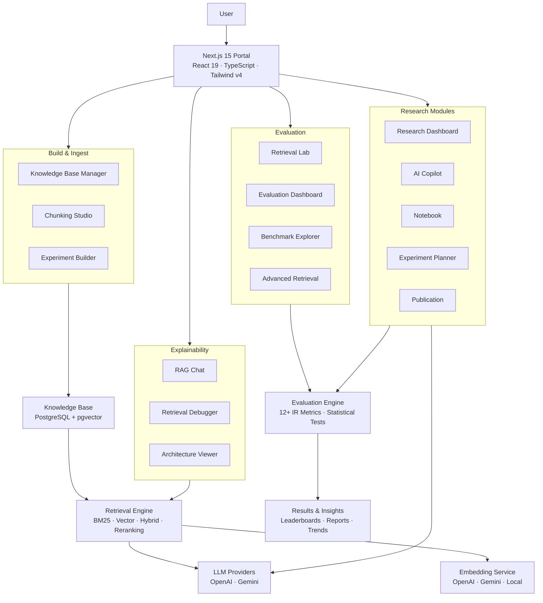

<p align="center">
  
</p>

<h1 align="center">Kairos</h1>

<p align="center">
  <strong>An Explainable AI Research Workbench for Retrieval-Augmented Generation</strong>
</p>

<p align="center">
  Document intelligence, benchmarking, and evaluation — with full transparency into how answers are constructed from your documents.
</p>

<p align="center">
  <a href="LICENSE"></a>
  <a href="#"></a>
  <a href="#"></a>
  <a href="#"></a>
  <a href="#"></a>
  <a href="#"></a>
  <a href="#"></a>
  <a href="#"></a>
  <a href="#"></a>
</p>

---

## What is Kairos?

Kairos is an open-source research workbench for **Retrieval-Augmented Generation** (RAG) pipelines. It provides end-to-end pipeline visibility across ingestion, chunking, embedding, retrieval, generation, and evaluation — with statistical rigor at every stage.

Most RAG tools give you a black box. **Kairos gives you full transparency:**

- **Every query decision is inspectable** — trace retrieval strategies, chunk selection, and generation inputs
- **Statistical rigor** — 12+ IR metrics with confidence intervals, p-values, and effect sizes
- **Reproducible experiments** — run multiple strategies against labeled datasets with full configuration capture
- **Production architecture** — Go gateway, Python intelligence engine, gRPC, Prometheus, and Docker

---

## Features

| Feature | Description |
|---------|-------------|
| **Explainable Retrieval** | Full pipeline trace per query. Inspect retrieved chunks, similarity scores, and document inclusion decisions. |
| **Statistical Evaluation** | 12+ metrics with confidence intervals, p-values, effect sizes, and distribution analysis. |
| **Benchmark Campaigns** | Leaderboard with composite scores. Run A/B comparisons across retrieval configurations. |
| **Experiment Tracking** | Run multiple strategies against labeled datasets. Capture configurations, results, and reproduce any experiment. |
| **RAG Chat** | Chat interface with inline citations and per-message pipeline traces. |
| **Chunking Studio** | 5 chunking strategies with visual preview and size analysis. |
| **Research Intelligence** | Automated pattern discovery, trend detection, root cause inference, and experiment suggestions. |
| **Architecture Visualization** | Interactive SVG diagram of the full system with module details. |
| **Report Generator** | Academic reports in Markdown with executive summaries, configuration matrices, and statistical analysis. |
| **Retrieval Lab** | Test retrieval configurations interactively with real-time parameter adjustment. |
| **Advanced Retrieval** | Compare hybrid search, query expansion, multi-query, and reranking strategies. |
| **AI Copilot** | Context-aware research assistant with intent detection, evidence selection, and grounding. |
| **Experiment Planner** | Automated experiment planning with cost-quality tradeoff analysis. |
| **Knowledge Base Management** | Upload, organize, and manage research documents with automatic chunking and embedding. |

---

## Architecture



---

## Tech Stack

| Layer | Technology |
|-------|------------|
| **Frontend** | Next.js 15, React 19, TypeScript 5.8, Tailwind CSS v4, Framer Motion, Recharts |
| **API Gateway** | Go 1.22, Chi Router, gRPC, Protocol Buffers |
| **Intelligence** | Python 3.11+, SentenceTransformers, NumPy, SciPy, scikit-learn |
| **Database** | PostgreSQL 15, pgvector, Prisma ORM |
| **Vector Store** | ChromaDB (pluggable) |
| **Observability** | Prometheus, Grafana, OpenTelemetry |
| **Infrastructure** | Docker, Docker Compose |

---

## Project Structure

```
kairos/
├── apps/
│   └── portal/                    # Next.js 15 frontend
│       ├── src/
│       │   ├── app/               # App router (pages & API routes)
│       │   │   ├── (marketing)/   # Public marketing pages
│       │   │   ├── app/           # Authenticated research workbench
│       │   │   └── api/           # API endpoints
│       │   ├── components/        # React components
│       │   │   ├── app/           # App-specific components
│       │   │   ├── marketing/     # Marketing page components
│       │   │   ├── research/      # Research UI components
│       │   │   └── ui/            # Design system primitives
│       │   └── lib/               # Utilities, AI subsystem
│       │       ├── ai/            # AI providers, chat, embeddings
│       │       ├── copilot/       # Research copilot engine
│       │       ├── evaluation/    # Metrics, benchmarks, statistics
│       │       ├── retrieval/     # Search strategies, debugger
│       │       └── telemetry/     # Analytics, health, metrics
│       └── prisma/                # Database schema
├── gateway/                       # Go API gateway
│   ├── api/                       # HTTP handlers
│   ├── middleware/                 # Auth, rate limiting, tracing
│   ├── queue/                     # Ingestion queue with worker pool
│   ├── cache/                     # Semantic + LRU cache
│   └── metrics/                   # Prometheus metrics
├── intelligence/                  # Python intelligence engine
│   ├── retrieval/                 # BM25, Hybrid, Complex, Multi-hop
│   ├── embeddings/                # SentenceTransformers + cache
│   ├── ingestion/                 # Document loading, chunking, pipeline
│   ├── cache/                     # Retrieval + embedding cache
│   ├── metrics/                   # Prometheus metrics (17 histograms)
│   ├── telemetry/                 # OpenTelemetry tracing
│   └── logging/                   # Structured JSON logging
├── benchmarks/                    # Evaluation framework
│   ├── load_test/                 # Concurrency load testing
│   ├── memory_profile/            # Memory profiling
│   └── rag_evaluation/            # BM25/Dense/Hybrid comparison
├── sdk/                           # Python SDK
├── tests/                         # 275+ tests
├── docker/                        # Multi-stage Dockerfiles
├── docs/                          # Documentation
└── proto/                         # gRPC contracts
```

---

## How It Works

### 1. Upload Documents

Upload PDFs, Word documents, plain text, or markdown files into a Knowledge Base. Documents are automatically chunked using one of 5 strategies (fixed-size, structural, semantic, paragraph, or heading-based) and embedded into a vector store.

### 2. Build Experiments

Configure retrieval experiments with different parameters:
- **Embedding models** — OpenAI, Gemini, or local SentenceTransformers
- **Retrieval strategies** — Vector, BM25, hybrid, or reranked
- **Chunking configurations** — Size, overlap, and strategy
- **Top-K values** — How many chunks to retrieve

### 3. Run Benchmarks

Execute benchmark campaigns against labeled datasets. Each run captures full configuration, per-question metrics, and retrieval traces for reproducibility.

### 4. Evaluate with Statistical Rigor

Kairos computes 12+ IR metrics per question:
- **Retrieval** — Recall@K, Precision@K, MRR, nDCG, Hit Rate, MAP, F1@K
- **Generation** — Faithfulness, Answer Relevance, Context Precision, Context Recall
- **Statistics** — Confidence intervals, p-values, effect sizes (Cohen's d, Cliff's delta)

### 5. Chat with Your Documents

Use the RAG Chat interface to ask questions and see exactly how answers are constructed. Each response includes inline citations, retrieved chunks, similarity scores, and a full pipeline trace.

---

## Supported Document Formats

| Format | Extension | Parser |
|--------|-----------|--------|
| PDF | `.pdf` | pypdf |
| Plain Text | `.txt` | Native UTF-8 |
| Markdown | `.md` | Native |
| CSV | `.csv` | csv-parse |

---

## Screenshots

<p align="center">
  
</p>

<p align="center">
  
</p>

<p align="center">
  
</p>

<p align="center">
  
</p>

<p align="center">
  
</p>

---

## Quick Start

### Option 1: Docker (Recommended)

```bash
git clone https://github.com/kairos-ai/kairos.git
cd kairos
cp .env.example .env
# Edit .env with your API keys
docker compose up -d
```

Visit [http://localhost:8080](http://localhost:8080)

### Option 2: Manual Setup

**Prerequisites:**
- Node.js 20+
- Python 3.11+
- Go 1.22+
- PostgreSQL 15+ (with pgvector extension)

```bash
git clone https://github.com/kairos-ai/kairos.git
cd kairos

# Frontend
cd apps/portal
cp .env.example .env
npm install
npx prisma generate
npx prisma db push
npm run dev

# Intelligence Engine (new terminal)
cd ../../
pip install -r requirements.txt
python -m intelligence.main

# Gateway (new terminal)
cd gateway
go run main.go
```

---

## Deployment

### Docker Compose

The full stack runs via Docker Compose with 8 services:

| Service | Port | Description |
|---------|------|-------------|
| `gateway` | 8080 | Go API gateway |
| `intelligence` | 28080 | Python gRPC server |
| `api` | 8000 | FastAPI REST server |
| `internal-dashboard` | 8501 | Streamlit dashboard |
| `worker` | — | Background ingestion worker |
| `chromadb` | 7777 | Vector database |
| `prometheus` | 9090 | Metrics collection |
| `grafana` | 3000 | Metrics visualization |

```bash
docker compose up -d
docker compose ps          # Check health
docker compose logs -f     # Follow logs
docker compose down        # Stop
```

### Resource Limits

| Service | CPU | Memory |
|---------|-----|--------|
| Intelligence | 2 cores | 4 GB |
| API | 1 core | 2 GB |
| Gateway | 0.5 core | 512 MB |
| ChromaDB | 1 core | 2 GB |
| Worker | 1 core | 2 GB |

---

## Environment Variables

### Required

| Variable | Description |
|----------|-------------|
| `DATABASE_URL` | PostgreSQL connection string for Prisma ORM |
| `KAIROS_SECRET` | Shared API secret for authentication |

### Intelligence Engine

| Variable | Description | Default |
|----------|-------------|---------|
| `KAIROS_LLM_PROVIDER` | LLM provider (`gemini`, `openai`, `ollama`) | — |
| `KAIROS_DEPLOYMENT` | Production mode with Groq | `False` |
| `KAIROS_CHUNK_SIZE` | Chunk size in characters | `1024` |
| `KAIROS_OVERLAP` | Chunk overlap in characters | `150` |
| `KAIROS_EMBEDDING_MODEL` | Embedding backend (`local`) | `local` |
| `KAIROS_CACHE_MAXSIZE` | Embedding cache size | `4096` |
| `KAIROS_CACHE_TTL_SECONDS` | Cache TTL in seconds | `300` |
| `KAIROS_METRICS_ENABLED` | Enable Prometheus metrics | `True` |
| `KAIROS_METRICS_PORT` | Prometheus metrics port | `8001` |
| `KAIROS_HEALTH_CHECK_ENABLED` | Enable gRPC health checks | `True` |
| `KAIROS_PROVIDER_TIMEOUT_SECONDS` | LLM provider timeout | `30.0` |
| `KAIROS_CIRCUIT_BREAKER_FAILURE_THRESHOLD` | Circuit breaker threshold | `5` |
| `KAIROS_CIRCUIT_BREAKER_RECOVERY_TIMEOUT` | Circuit breaker recovery | `30.0` |

### AI Providers

| Variable | Description |
|----------|-------------|
| `GEMINI_API_KEY` | Google Gemini API key |
| `KAIROS_GEMINI_MODEL_NAME` | Gemini model name |
| `OPENAI_API_KEY` | OpenAI API key |
| `KAIROS_OPENAI_MODEL_NAME` | OpenAI model name |
| `GROQ_API_KEY` | Groq API key (production) |
| `GROQ_BASE_URL` | Groq base URL |

### Gateway

| Variable | Description | Default |
|----------|-------------|---------|
| `GATEWAY_HOST` | Gateway bind host | `0.0.0.0` |
| `GATEWAY_PORT` | Gateway port | `8080` |
| `KAIROS_RATE_LIMIT` | Requests per second per namespace | — |
| `KAIROS_BURST_LIMIT` | Burst limit | — |
| `MAX_FILE_SIZE` | Max upload size in MB | `50` |
| `KAIROS_CACHE_MAX_SIZE` | Semantic cache size | — |
| `KAIROS_CACHE_TTL` | Semantic cache TTL (seconds) | — |
| `KAIROS_CACHE_SIMILARITY_THRESHOLD` | Cache similarity threshold | — |
| `KAIROS_CORS_ORIGINS` | Allowed CORS origins | `*` |

See [`.env.example`](.env.example) for the full configuration reference.

---

## API Reference

### Gateway Endpoints (port 8080)

| Method | Endpoint | Description |
|--------|----------|-------------|
| `GET` | `/health` | Health check |
| `POST` | `/v1/query` | Execute RAG query |
| `POST` | `/v1/ingest` | Upload document |
| `GET` | `/v1/jobs/{job_id}` | Check job status |
| `GET` | `/metrics` | Prometheus metrics |

### Intelligence Engine (port 28080 — gRPC)

| RPC | Description |
|-----|-------------|
| `ComputeEmbeddings` | Generate embeddings for text |
| `ClassifyQueryType` | Classify query and select retrieval strategy |
| `ExecuteRetrieval` | Execute retrieval with given config |
| `GenerateResponse` | Generate LLM response from context |
| `IngestDocument` | Ingest and index a document |

---

## Benchmarks

### Retrieval Metrics

| Metric | Description |
|--------|-------------|
| Recall@K | Proportion of relevant documents retrieved in top K |
| Precision@K | Proportion of retrieved documents that are relevant |
| MRR | Mean Reciprocal Rank of first relevant result |
| nDCG@K | Normalized Discounted Cumulative Gain |
| Hit Rate | Whether any relevant document appears in top K |
| MAP | Mean Average Precision across queries |
| F1@K | Harmonic mean of Precision@K and Recall@K |

### Generation Metrics

| Metric | Description |
|--------|-------------|
| Faithfulness | LLM-judged answer faithfulness to context |
| Answer Relevance | LLM-judged answer relevance to question |
| Context Precision | LLM-judged context quality |
| Context Recall | LLM-judged context completeness |

### Statistical Tests

| Test | Description |
|------|-------------|
| Paired t-test | Compare two configurations |
| Wilcoxon signed-rank | Non-parametric comparison |
| Cohen's d | Effect size measurement |
| Cliff's delta | Non-parametric effect size |
| Confidence intervals | 95% CI for all metrics |

---

## Roadmap

- [ ] HNSW indexing for faster vector search
- [ ] Streaming RAG responses
- [ ] Multi-tenant support
- [ ] Custom embedding model training
- [ ] Automated hyperparameter optimization
- [ ] Integration with LangChain and LlamaIndex
- [ ] Real-time collaboration on experiments
- [ ] Export to Jupyter notebooks

---

## Contributing

See [CONTRIBUTING.md](CONTRIBUTING.md) for:
- Development setup
- Code style guide
- Pull request process
- Architecture overview

---

## Security

See [SECURITY.md](SECURITY.md) for:
- Vulnerability reporting
- Security best practices
- Supported versions

---

## License

MIT License — see [LICENSE](LICENSE) for details.

---

<p align="center">
  Built with care for the RAG research community.
</p>

## Support

If you found Kairos useful, consider giving the repository a ⭐ on GitHub.