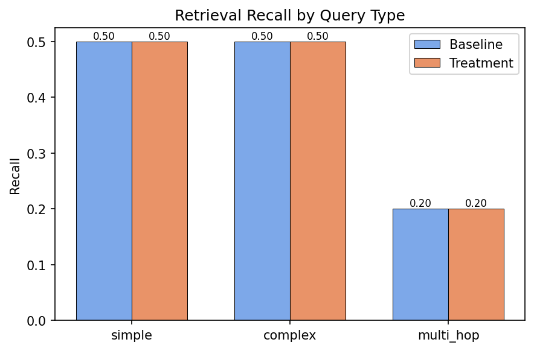
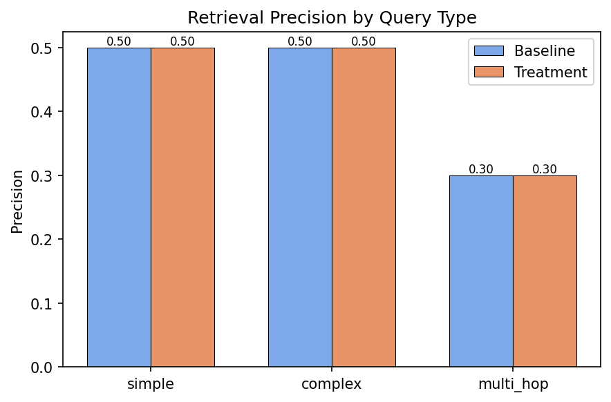
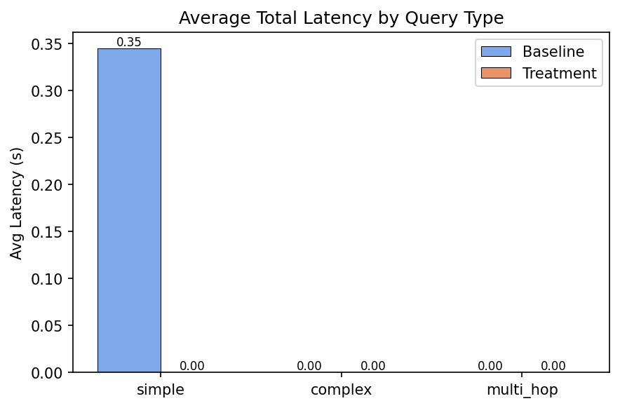
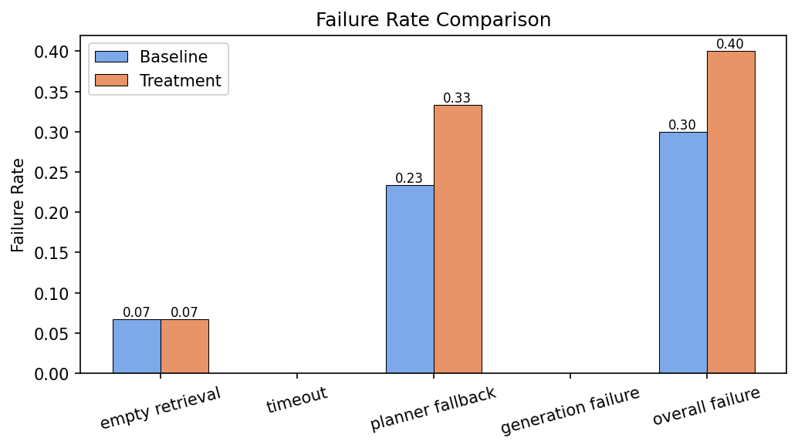

# Kairos Experiment Summary

**Generated:** 2026-06-19 13:18:58

---

## Executive Summary

This report compares the **Baseline** (static strategy, no confidence-aware
budgeting, no fallback escalation) against the **Treatment** (Kairos adaptive
retrieval with confidence-aware budget allocation and fallback management)
across **30 queries** (10 simple, 10 complex,
10 multi-hop).

### Key Findings

- **Recall delta:** +0.0%
- **Precision delta:** +0.0%
- **Latency delta:** -0.115076 (treatment - baseline)
- **Overall failure rate delta:** +10.0%

- Recall was identical between baseline and treatment.
- Precision was identical between baseline and treatment.
- Treatment was 0.1151s faster on average (-99.9% relative).
- Treatment triggered planner fallback on +10.0% more queries, indicating the fallback mechanism is operational.
- Overall failure rate delta: +10.0%.

---

## Aggregate Metrics

| Metric | Baseline | Treatment | Δ (Treatment − Baseline) |
|--------|---------|-----------|--------------------------|
| Recall | 40.0% | 40.0% | +0.0% |
| Precision | 43.3% | 43.3% | +0.0% |
| Avg Latency (s) | 0.1152 | 0.0001 | -0.115076 |
| Empty Retrieval | 6.7% | 6.7% | +0.0% |
| Timeout | 0.0% | 0.0% | +0.0% |
| Planner Fallback | 23.3% | 33.3% | +10.0% |
| Generation Failure | 0.0% | 0.0% | +0.0% |
| Overall | 30.0% | 40.0% | +10.0% |

---

## Per-Type Metrics

### Recall

| Type | Baseline | Treatment | Δ |
|------|----------|-----------|----|
| Simple | 50.0% | 50.0% | +0.0% |
| Complex | 50.0% | 50.0% | +0.0% |
| Multi-hop | 20.0% | 20.0% | +0.0% |

### Precision

| Type | Baseline | Treatment | Δ |
|------|----------|-----------|----|
| Simple | 50.0% | 50.0% | +0.0% |
| Complex | 50.0% | 50.0% | +0.0% |
| Multi-hop | 30.0% | 30.0% | +0.0% |

### Average Latency (seconds)

| Type | Baseline | Treatment | Δ |
|------|----------|-----------|----|
| Simple | 0.3451 | 0.0001 | -0.114988 |
| Complex | 0.0002 | 0.0001 | -0.000033 |
| Multi-hop | 0.0003 | 0.0001 | -0.000055 |

---

## Failure Analysis

### Aggregate Failure Rates

| Category | Baseline | Treatment | Δ |
|----------|----------|-----------|----|
| Empty Retrieval | 6.7% | 6.7% | +0.0% |
| Timeout | 0.0% | 0.0% | +0.0% |
| Planner Fallback | 23.3% | 33.3% | +10.0% |
| Generation Failure | 0.0% | 0.0% | +0.0% |
| Overall | 30.0% | 40.0% | +10.0% |

### Per-Type Failure Rates

#### Simple

| Category | Δ Rate |
|----------|--------|
| Empty Retrieval | +0.0% |
| Timeout | +0.0% |
| Planner Fallback | +0.0% |
| Generation Failure | +0.0% |
| Overall | +0.0% |

#### Complex

| Category | Δ Rate |
|----------|--------|
| Empty Retrieval | +0.0% |
| Timeout | +0.0% |
| Planner Fallback | +0.0% |
| Generation Failure | +0.0% |
| Overall | +0.0% |

#### Multi-hop

| Category | Δ Rate |
|----------|--------|
| Empty Retrieval | +0.0% |
| Timeout | +0.0% |
| Planner Fallback | +30.0% |
| Generation Failure | +0.0% |
| Overall | +30.0% |

---

## Planner Observations

- **Baseline** used the static HIGH-confidence config for all queries
  (simple: ``top_k=3, rerank=False``; complex: ``top_k=8, rerank=True``;
  multi_hop: ``top_k=3, decompose=True``).
- **Treatment** used confidence-aware budget overrides:
  - **Simple** (high confidence): static budget applied for both.
  - **Complex** (medium confidence): treatment increases ``top_k`` from 8 to 10 and enables ``rerank``.
  - **Multi-hop** (low confidence): treatment increases ``top_k`` from 3 to 8 and enables ``rerank``.
- The `_StaticPlanner` always reports ``confidence=1.0``, so the baseline
  never triggers fallback escalation. The treatment uses the true
  classifier confidence, which can fall below the ``CONFIDENCE_HIGH``
  threshold and trigger both budget overrides and fallback escalation.

### Fallback Analysis

- **Multi-hop**: Treatment increased planner fallback rate by +30.0%. 

- Overall, baseline had a 30.0% failure rate while treatment had 40.0%.

---

## Charts

*Figure 1: Retrieval recall by query type.*

*Figure 2: Retrieval precision by query type.*

*Figure 3: Average total latency by query type.*

*Figure 4: Failure rate comparison by category.*
