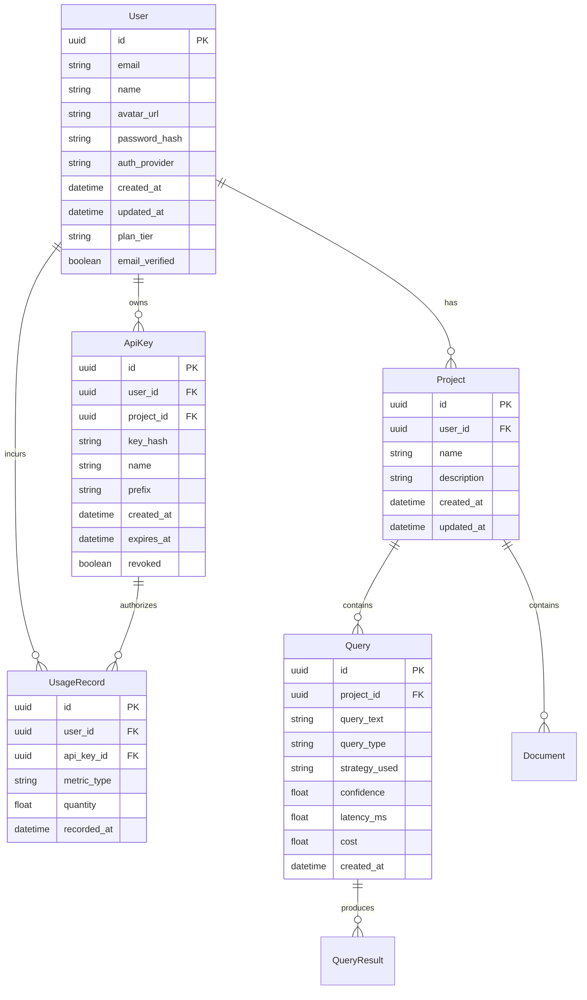

# SaaS Architecture

**Phase 14 — Product Transformation**  
**Status:** Planning  

---

## Production Architecture

```
Browser
    │
    ▼
┌─────────────────────────────────────────┐
│         Vercel (Frontend)                │
│  Next.js 15 + React 19 + TypeScript      │
│  TailwindCSS · Framer Motion · shadcn/ui │
│  TanStack Query · React Hook Form         │
│  Recharts · Lucide Icons                  │
│                                          │
│  ┌──────────────────────────────────┐   │
│  │     apps/portal/ (Next.js App)    │   │
│  │  Marketing Site  ───  App Router │   │
│  │  Auth Pages      ───  SSR/SSG    │   │
│  │  Dashboard       ───  CSR        │   │
│  │  API Proxy       ───  Rewrites   │   │
│  └──────────────────────────────────┘   │
└──────────────────┬──────────────────────┘
                   │ HTTPS
                   ▼
┌─────────────────────────────────────────┐
│      Cloudflare / Route 53 (DNS + CDN)   │
│  ┌──────────────────────────────────┐   │
│  │  api.kairos.dev  (REST)          │   │
│  │  auth.kairos.dev (Auth)          │   │
│  │  app.kairos.dev  (App)           │   │
│  └──────────────────────────────────┘   │
└──────────────────┬──────────────────────┘
                   │
                   ▼
┌─────────────────────────────────────────┐
│         Docker Host (Backend)            │
│  ┌──────────────────────────────────┐   │
│  │   Go API Gateway (port 8080)      │   │
│  │   Auth · Rate Limit · Cache · TLS │   │
│  │   Routes → /api/v1/*              │   │
│  └────────────┬─────────────────────┘   │
│               │ gRPC                    │
│  ┌────────────▼─────────────────────┐   │
│  │   Python Intelligence Service     │   │
│  │   gRPC · FastAPI · Workers        │   │
│  │   28 modules                      │   │
│  └────────────┬─────────────────────┘   │
│               │                         │
│  ┌────────────▼─────────────────────┐   │
│  │   FastAPI Management API         │   │
│  │   /api/v1/config, /observability │   │
│  └────────────┬─────────────────────┘   │
│               │                         │
│  ┌────────────▼──────────────┐          │
│  │  Postgres  │   Redis      │          │
│  │  (primary  │   (cache,    │          │
│  │   store)   │    sessions) │          │
│  └────────────┴──────────────┘          │
│  ┌──────────────────────────────────┐   │
│  │   ChromaDB (Vector Store)        │   │
│  └──────────────────────────────────┘   │
└──────────────────┬──────────────────────┘
                   │
                   ▼
┌─────────────────────────────────────────┐
│         Observability Stack              │
│  Prometheus → Grafana → Alerts          │
│  OpenTelemetry → Traces                 │
│  Structured JSON Logging                │
└─────────────────────────────────────────┘
```

---

## Service Architecture

### 1. Frontend (Vercel)

| Component | Technology | Purpose |
|-----------|-----------|---------|
| Marketing Site | Next.js SSR/SSG | Landing, features, pricing, blog, docs |
| Auth Pages | Next.js SSR | Login, signup, password reset, magic link |
| App Dashboard | Next.js CSR (client route) | Authenticated user experience |
| API Proxy | Next.js rewrites | Proxy `/api/*` to backend, add auth headers |

### 2. API Gateway (Go)

| Component | Technology | Purpose |
|-----------|-----------|---------|
| Router | chi (v5) | HTTP routing, CORS, middleware chain |
| Auth Middleware | Go | API key validation, JWT verification |
| Rate Limiter | Go token bucket | Per-key, per-IP rate limiting |
| Cache | LRU + Redis | Response caching, embedding cache |
| gRPC Client | protobuf | Communication to Python intelligence |
| Metrics | Prometheus | Request count, latency, error rate |

### 3. Intelligence Service (Python)

| Component | Purpose |
|-----------|---------|
| Classifier | Query complexity classification |
| Planner | Adaptive retrieval planning |
| Retrievers | Hybrid, deep semantic, multi-hop |
| Calibrator | Confidence calibration |
| Judge | LLM-based response judging |
| Optimizer | Budget optimization |
| Feedback | Feedback collection and learning |
| Training | Online retraining pipelines |

### 4. Management API (Python/FastAPI)

| Route | Purpose |
|-------|---------|
| `/api/v1/config` | Configuration management |
| `/api/v1/observability` | Metrics, tracing, events |
| `/api/v1/evaluation` | Benchmark evaluation |
| `/api/v1/artifacts` | Model registry, experiment registry |

### 5. Storage

| System | Purpose |
|--------|---------|
| Postgres | Users, projects, API keys, usage records, billing |
| Redis | Sessions, cache, rate limit counters, job queues |
| ChromaDB | Vector embeddings, document storage |

---

## Auth Architecture

```
┌─────────┐    ┌──────────┐    ┌──────────┐
│ Browser │───▶│  Next.js │───▶│   Auth   │
│         │    │  Server  │    │ Provider │
└─────────┘    └──────────┘    └──────────┘
                                    │
                    ┌───────────────┴───────────────┐
                    │                               │
            ┌───────▼───────┐            ┌──────────▼──────┐
            │  NextAuth.js  │            │  Magic Link     │
            │  (Auth.js)    │            │  (Resend)       │
            │  Email        │            └─────────────────┘
            │  Google       │
            │  GitHub       │
            │  Credentials  │
            └───────┬───────┘
                    │
                    ▼
            ┌───────────────┐
            │   Postgres    │
            │   (User DB)   │
            └───────────────┘
```

- **Auth.js (NextAuth.js v5)** — Authentication framework
- **Providers**: Email (passwordless), Google OAuth, GitHub OAuth, Credentials (email/password)
- **Magic link**: Passwordless via Resend or SendGrid
- **JWT**: Short-lived access tokens + refresh tokens
- **MFA**: Ready for TOTP (can be added post-MVP)
- **Session storage**: Redis for server-side sessions (optional JWT-only mode)

---

## API Design

### Gateway Routes (Go → chi)

```
GET    /health                  Health check
GET    /metrics                 Prometheus metrics

# v1 REST API
POST   /v1/query                Execute retrieval query
POST   /v1/ingest               Ingest documents
GET    /v1/jobs/{id}            Check ingestion job status

# Admin/Management
GET    /v1/usage                Usage statistics
GET    /v1/keys                 List API keys
POST   /v1/keys                 Create API key
DELETE /v1/keys/{id}            Revoke API key
```

### Management Routes (FastAPI)

```
GET    /health                  Health check
GET    /docs                    Swagger UI (dev only)

/api/v1/config                  Configuration
  GET    /                      Get current config
  PUT    /                      Update config

/api/v1/observability           Observability
  GET    /metrics               Runtime metrics
  GET    /traces                Distributed traces
  POST   /events                Log structured event

/api/v1/evaluation              Evaluation
  POST   /run                   Run evaluation
  GET    /results               List evaluation results

/api/v1/artifacts               Artifacts
  GET    /models                List registered models
  POST   /models                Register model
  GET    /experiments           List experiments
  POST   /experiments           Create experiment
```

---

## Data Model



---

## Security Architecture

| Layer | Mechanism |
|-------|-----------|
| Transport | TLS 1.3 (Cloudflare + backend) |
| API Auth | JWT Bearer tokens + API key headers |
| Rate Limiting | Token bucket per API key + per IP |
| Input Validation | Pydantic (Python), Go struct validation |
| Secrets | Environment variables via SecretProvider |
| DB Encryption | Postgres TLS, encrypted connections |
| CORS | Restricted origins per environment |
| Auth Provider | NextAuth.js with secure HTTP-only cookies |

---

## Observability

| System | Purpose | Stack |
|--------|---------|-------|
| Metrics | Request rates, latencies, errors | Prometheus + Go client |
| Dashboards | System health, usage trends | Grafana |
| Logging | Structured JSON logs | Python logging + Go zerolog |
| Tracing | Distributed request traces | OpenTelemetry |
| Alerts | Pager notifications | Grafana Alerting |
| Uptime | External monitoring | Better Uptime / Checkly |

---

## Migration Path

### Current → Target

| Component | Current | Target |
|-----------|---------|--------|
| Marketing Site | Static export (apps/portal/) | SSR on Vercel |
| Dashboard | Streamlit (dashboard/) | Next.js app (apps/portal/) |
| API Gateway | Go (gateway/) | Same + new routes |
| Intelligence | Python (intelligence/) | Same |
| Auth | API key only | NextAuth.js + API keys |
| Storage | ChromaDB only | Postgres + ChromaDB + Redis |
| Deployment | Docker Compose | Docker + Vercel |

### Milestones

See `PHASE14_IMPLEMENTATION_PLAN.md` for the full phased rollout.
