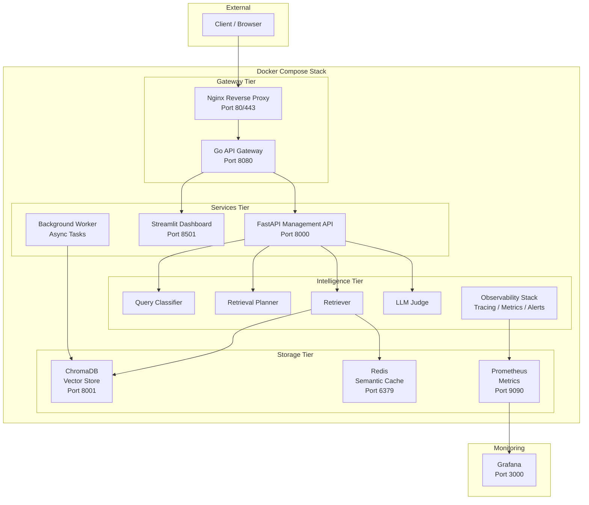

```mermaid
flowchart TD
    subgraph External["External"]
        Client["Client / Browser"]
    end

    subgraph Docker["Docker Compose Stack"]
        subgraph Gateway["Gateway Tier"]
            Nginx["Nginx Reverse Proxy<br/>Port 80/443"]
            GoGateway["Go API Gateway<br/>Port 8080"]
        end

        subgraph Services["Services Tier"]
            FastAPI["FastAPI Management API<br/>Port 8000"]
            Dashboard["Streamlit Dashboard<br/>Port 8501"]
            Worker["Background Worker<br/>Async Tasks"]
        end

        subgraph Intelligence["Intelligence Tier"]
            Classifier["Query Classifier"]
            Planner["Retrieval Planner"]
            Retriever["Retriever"]
            Judge["LLM Judge"]
            Observability["Observability Stack<br/>Tracing / Metrics / Alerts"]
        end

        subgraph Storage["Storage Tier"]
            ChromaDB["ChromaDB<br/>Vector Store<br/>Port 8001"]
            Redis["Redis<br/>Semantic Cache<br/>Port 6379"]
            Prometheus["Prometheus<br/>Metrics<br/>Port 9090"]
        end

        Client --> Nginx
        Nginx --> GoGateway
        GoGateway --> FastAPI
        GoGateway --> Dashboard

        FastAPI --> Classifier
        FastAPI --> Planner
        FastAPI --> Retriever
        FastAPI --> Judge

        Retriever --> ChromaDB
        Retriever --> Redis
        Worker --> ChromaDB

        Observability --> Prometheus
    end

    subgraph Monitoring["Monitoring"]
        Grafana["Grafana<br/>Port 3000"]
        Prometheus --> Grafana
    end
```
