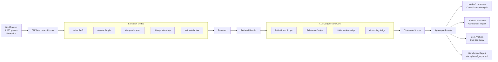

```mermaid
flowchart LR
    Dataset["Gold Dataset<br/>1,020 queries<br/>5 domains"] --> Runner["E2E Benchmark Runner"]

    subgraph Modes["Execution Modes"]
        NR["Naive RAG"]
        AS["Always Simple"]
        AC["Always Complex"]
        AM["Always Multi-Hop"]
        KA["Kairos Adaptive"]
    end

    Runner --> Modes
    Modes --> Retriever["Retriever"]

    Retriever --> Results["Retrieval Results"]

    subgraph Judge["LLM Judge Framework"]
        F["Faithfulness Judge"]
        R["Relevance Judge"]
        H["Hallucination Judge"]
        G["Grounding Judge"]
    end

    Results --> Judge
    Judge --> Scores["Dimension Scores"]
    Scores --> Aggregate["Aggregate Results"]

    Aggregate --> Compare["Mode Comparison<br/>Cross-Domain Analysis"]
    Aggregate --> Ablate["Ablation Validation<br/>Component Impact"]
    Aggregate --> Cost["Cost Analysis<br/>Cost per Query"]
    Aggregate --> Report["Benchmark Report<br/>docs/phase9_report.md"]
```
