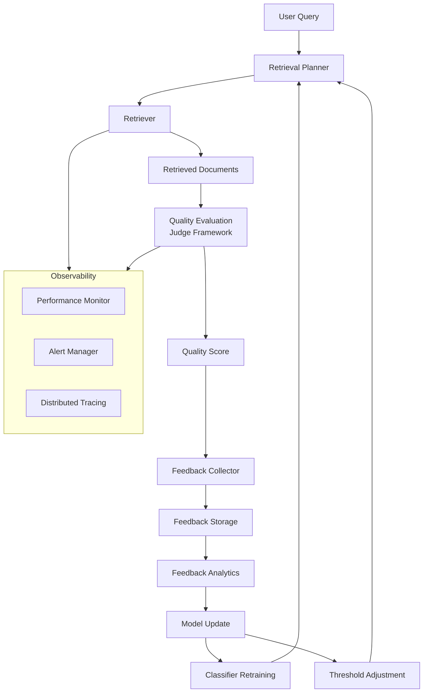

```mermaid
flowchart TD
    Query["User Query"] --> Plan["Retrieval Planner"]
    Plan --> Retrieve["Retriever"]
    Retrieve --> Documents["Retrieved Documents"]
    Documents --> Eval["Quality Evaluation<br/>Judge Framework"]
    Eval --> Score["Quality Score"]

    Score --> FeedbackCollector["Feedback Collector"]
    FeedbackCollector --> FeedbackStorage["Feedback Storage"]
    FeedbackStorage --> FeedbackAnalytics["Feedback Analytics"]

    FeedbackAnalytics --> ModelUpdate["Model Update"]
    ModelUpdate --> ClassifierUpdate["Classifier Retraining"]
    ModelUpdate --> ThresholdUpdate["Threshold Adjustment"]

    ClassifierUpdate --> Plan
    ThresholdUpdate --> Plan

    subgraph Metrics["Observability"]
        Performance["Performance Monitor"]
        Alerts["Alert Manager"]
        Tracing["Distributed Tracing"]
    end

    Retrieve --> Metrics
    Eval --> Metrics
```
