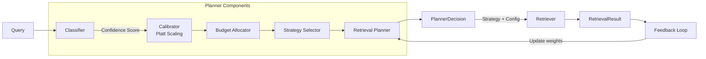

```mermaid
flowchart LR
    Query["Query"] --> Classifier["Classifier"]
    Classifier -->|Confidence Score| Calibrator["Calibrator<br/>Platt Scaling"]
    Calibrator --> Budget["Budget Allocator"]
    Budget --> Strategy["Strategy Selector"]
    Strategy --> Planner["Retrieval Planner"]

    Planner --> Decision["PlannerDecision"]
    Decision -->|Strategy + Config| Retriever["Retriever"]

    Retriever --> Result["RetrievalResult"]

    subgraph Planner_Components["Planner Components"]
        Classifier
        Calibrator
        Budget
        Strategy
        Planner
    end

    Result --> Feedback["Feedback Loop"]
    Feedback -->|Update weights| Planner
```
