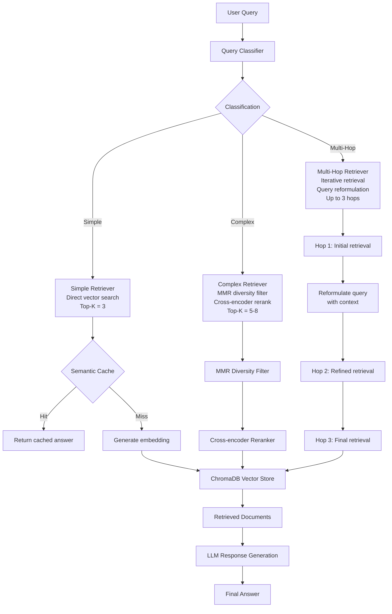

```mermaid
flowchart TD
    Query["User Query"] --> Classifier["Query Classifier"]
    Classifier --> Decision{"Classification"}
    Decision -->|Simple| SimpleRet["Simple Retriever<br/>Direct vector search<br/>Top-K = 3"]
    Decision -->|Complex| ComplexRet["Complex Retriever<br/>MMR diversity filter<br/>Cross-encoder rerank<br/>Top-K = 5-8"]
    Decision -->|Multi-Hop| MultiHopRet["Multi-Hop Retriever<br/>Iterative retrieval<br/>Query reformulation<br/>Up to 3 hops"]

    SimpleRet --> Cache{"Semantic Cache"}
    Cache -->|Hit| CacheResponse["Return cached answer"]
    Cache -->|Miss| Embed["Generate embedding"]
    Embed --> ChromaDB["ChromaDB Vector Store"]

    ComplexRet --> MMR["MMR Diversity Filter"]
    MMR --> Rerank["Cross-encoder Reranker"]
    Rerank --> ChromaDB

    MultiHopRet --> Hop1["Hop 1: Initial retrieval"]
    Hop1 --> Reformulate["Reformulate query<br/>with context"]
    Reformulate --> Hop2["Hop 2: Refined retrieval"]
    Hop2 --> Hop3["Hop 3: Final retrieval"]
    Hop3 --> ChromaDB

    ChromaDB --> Documents["Retrieved Documents"]
    Documents --> LLM["LLM Response Generation"]
    LLM --> Response["Final Answer"]
```
